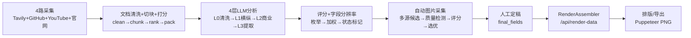

# AI自媒体知识卡片生产系统 — 完整规格书

> 版本 1.0 | 2026-06-19 | 目标读者：新接手开发者
>
> 读完本文档 + 跑通一次研究 = 理解系统 95% 的内容与细节。

---

## 目录

1. [项目概述](#1-项目概述)
2. [系统架构全景](#2-系统架构全景)
3. [研究工作流](#3-研究工作流)
4. [噪音与上下文治理](#4-噪音与上下文治理)
5. [评分体系](#5-评分体系)
6. [证据与字段分辨率](#6-证据与字段分辨率)
7. [多Agent系统](#7-多agent系统)
8. [SourceAdapter 适配器体系](#8-sourceadapter-适配器体系)
9. [CoverageGate 覆盖门控](#9-coveragegate-覆盖门控)
10. [定稿工作流](#10-定稿工作流)
11. [图片资产系统](#11-图片资产系统)
12. [卡片与渲染系统](#12-卡片与渲染系统)
13. [排版中心](#13-排版中心)
14. [卡片制作台与导出](#14-卡片制作台与导出)
15. [数据模型全表清单](#15-数据模型全表清单)
16. [API 完整清单](#16-api-完整清单)
17. [前端架构](#17-前端架构)
18. [配置与环境变量](#18-配置与环境变量)
19. [关键设计决策](#19-关键设计决策)
20. [已知局限与风险](#20-已知局限与风险)
21. [日常操作速查](#21-日常操作速查)

---

## 1. 项目概述

### 一句话定义

**输入公司名 + 官网 URL → 自动研究 → 人工定稿 → 输出 3:4 知识卡片 PNG（支持三套卡片规格）。**

### 核心流水线

```
研究台(/) → 定稿台(/editor) → 卡片制作台(/canvas) / 排版中心(/layout) → 导出 PNG
```

四个工作台分别对应四个阶段：自动采集与分析 → 人工校验与定稿 → 卡片可视化编辑 → 排版与批量导出。

### 技术栈

| 层 | 技术 |
|---|---|
| 后端 | Python 3 + Flask（单文件 app.py + Blueprint 路由） |
| LLM | DeepSeek V4 Pro（兼容 OpenAI SDK 接口） |
| 数据库 | SQLite3 × 5（标准库 sqlite3，无 ORM） |
| 前端 | Vanilla JS + CDN（无 React/Vue） |
| 卡片渲染 | HTML/CSS 模板 + iframe 预览（无 fabric.js） |
| 网页抓取 | trafilatura（本地，不依赖外部 API） |
| 图表 | ECharts 5.6（本地 vendor，不依赖 CDN） |
| 截图 | Playwright（Puppeteer） |
| 搜索 | Tavily API（多 Key 轮转） |

### 三套卡片规格

| 套卡 | set_key | 卡片数 | 定位 |
|---|---|---|---|
| v1 经典版 | `v1` | 8 张 | 经典自媒体卡片 |
| v2 新版 | `v2` | 7 张 | 精简商业分析版 |
| v3 研究增强版 | `v3` | 8 张 | 研究报告深度版，支持 Markdown/PDF/Notion 导出 |

---

## 2. 系统架构全景

### 2.1 五个 SQLite 数据库

```
research_db.sqlite    — 研究原始数据 + 证据 + 字段分辨率 + 任务状态 + 规范化实体（10 张）
final_db.sqlite       — 人工定稿字段（按 company+field_key 唯一键）
assets_db.sqlite      — 图片素材槽位（12 种 asset_key）+ 候选池（image_variants）
composition_db.sqlite — 卡片编排（每张卡有哪些字段/图片）
template_db.sqlite    — 模板定义 + 排版实例
```

### 2.2 数据流向（主链路）



### 2.3 文件目录约定

```
prompts/              — LLM Prompt 文件（L0-L3 + L3 三组枚举提取 A/B/C）
webapp/               — Flask 应用主目录
  app.py                — Flask 入口（路由注册 + 后台任务）
  pipeline.py           — 研究流水线主逻辑
  deepseek_client.py    — DeepSeek API 封装（load_prompt + chat）
  firecrawl_local.py    — 本地 trafilatura 网页抓取
  competitive_scoring.py— 评分计算（枚举→数值→加权公式）
  field_rules.py        — Layer 1 规则层（零 LLM 成本）
  field_validator.py    — Layer 3 Pydantic 白名单验证
  infographic.py        — ECharts/SVG 图表渲染 + Playwright 截图
  asset_pipeline.py     — 自动图片采集流水线
  image_candidate.py    — ImageCandidate 标准化数据类
  image_quality.py      — Pillow 质量硬过滤
  image_scorer.py       — 规则评分器（6 维打分）
  image_query.py        — 按槽位构建图片搜索策略
  image_search.py       — 多源图片搜索（Pexels→Unsplash→Tavily）
  screenshot_client.py  — Playwright 截图客户端
  path_safety.py        — 公司名/路径片段安全清理
  asset_store.py        — company_assets 表 CRUD
  db.py                 — SQLite 访问辅助
  config.py             — 环境变量配置读取
  routes/               — Blueprint 路由模块
  services/             — 业务逻辑层
  repositories/         — 数据访问层（entity_repo.py 等）
  research/             — 证据与字段分辨率
    context/            — 噪音治理：cleaner/chunker/ranker/packer/budget
  research_agents/      — 多 Agent 系统（11 Agent + forum + resolvers + storage + orchestrator）
  db/                   — 迁移脚本（migrate.py + migrate_entities.py）
  static/               — 前端 JS/CSS/vendor
  templates/            — Jinja2 页面模板
image-studio/          — 图片定稿台（独立 HTML + JS/CSS）
canvas/                — 卡片制作台 + Puppeteer 截图脚本
  js/                    — 渲染器/编辑器/Markdown 解析
  screenshot.js          — Puppeteer PNG 批量导出 CLI
db/                    — SQLite 建表 SQL + 迁移 + 数据库文件
contracts/             — RenderContract Schema + asset_keys.json + card_sets/
docs/                  — 架构/评分/卡片规范/运行手册
tests/                 — pytest 回归测试（636+ passed）
scripts/               — 覆盖率检查 + 导出回归 + 审计脚本
output/                — 导出输出（卡片 PNG、调试报告）
```

---

## 3. 研究工作流

### 3.1 启动方式

```bash
# API 启动
curl -X POST http://127.0.0.1:5050/api/research/start \
  -H "Content-Type: application/json" \
  -d '{"company_name":"Anthropic","company_url":"https://www.anthropic.com"}'
# 返回 {"job_id":"abc123","status":"running"}

# 或通过研究台 UI http://127.0.0.1:5050/
```

研究在后台线程（daemon thread）中执行，状态通过 `research_jobs` 表持久化，Flask 重启后状态不丢失。

### 3.2 四路并行采集（Step 1）

| 数据源 | 工具 | 说明 |
|---|---|---|
| Tavily 搜索 | Tavily API | 自适应多意图搜索，多 Key 轮转，查询结果缓存 86400s |
| GitHub | GitHub API | 搜索公司相关仓库（README/stars/forks/issues） |
| YouTube | YouTube API | 搜索创始人访谈视频 + 字幕提取 |
| 官网抓取 | trafilatura（本地） | 爬取公司官网全部页面 |

**Tavily 自适应模式**（默认开启）：
- 初始 10 个 `basic` 查询（不带 raw_content）
- 评估证据覆盖后，仅对缺失的高优先级意图（market_size/pricing_details/customers/unit_economics）升级为 `advanced`
- 标准预算 14 查询，深度预算 24 查询
- 查询结果按 `TAVILY_CACHE_TTL_SECONDS`（默认 86400s）缓存
- 每个查询完成后实时上报进度，研究台显示 `采集中 N/total 组查询`
- 429/432 配额错误自动切换到下一个 Key

### 3.3 四层 LLM 分析（Step 2）

每层使用独立的 Prompt 文件（`prompts/` 目录）、独立的 token 预算和独立的 DeepSeek 调用：

| 层 | Prompt 文件 | 职责 | Token 预算 |
|---|---|---|---|
| L0 | `layer0-cleaner.md` | 信息清洗：去重、去噪、结构化重组 | ≤ 18,000 |
| L1 | `layer1-hv-analysis.md` | 横向（竞品对比）+ 纵向（行业历史）分析 | ≤ 8,000 |
| L2 | `layer2-business.md` | 商业结构分析：商业模式、GTM、壁垒 | ≤ 10,000 |
| L3 | `layer3-field-extraction.md` | 字段提取：45+ 个结构化字段 | ≤ 12,000 |

每次研究生成 **3 个版本**：
- **standard** — 标准版：客观完整，数据优先
- **business** — 商业版：投资人视角
- **spread** — 传播版：高钩子密度，自媒体友好

每个版本独立跑一遍 L0-L3。任一版本 L3 失败 → 整个任务标记失败，不写入假成功记录。

### 3.4 三层枚举字段提取管道（Step 2.5）

10 个竞争评分枚举字段不走 L3 主调用，单独走三层解耦管道：

**Layer 1 — 规则层** `field_rules.py`（零 LLM 成本）：
- `infer_stack_layer()`：91 个关键词匹配 `company_type` → 5 层 AI 栈枚举
- `scrape_pricing_signals()`：爬 `/pricing` 页面，22 个关键词 + 兜底逻辑 → `pricing_model` + `customer_segment_type`

**Layer 2 — LLM 三组调用**：

| 组 | Prompt | 字段 | 并行策略 |
|---|---|---|---|
| A | `layer3-group-a-technical.md` | `ai_model_dependency`, `data_flywheel`, `proprietary_data_asset` | 与 B 并行 |
| B | `layer3-group-b-competitive.md` | `incumbent_direct_competitor`, `workflow_integration_level`, `inference_cost_exposure` | 与 A 并行 |
| C | `layer3-group-c-business.md` | `pricing_model`, `customer_segment_type`, `stack_layer` | 串行（注入规则层结果） |

3 个关键字段（`ai_model_dependency`, `incumbent_direct_competitor`, `pricing_model`）多数投票 2-3 轮。

**Layer 3 — 验证层** `field_validator.py`：
- Pydantic `BaseModel`，10 个 `@field_validator`
- 值不在白名单 → `ValueError` → 任务失败

**合并优先级**：`规则层命中 > LLM 三组合并结果`

### 3.5 评分与写入（Step 3）

```
枚举字段 → 数值映射 → 3 个加权公式 → 写入 research 表
    │
    ├── score_defensibility（护城河强度）   = 0.30×data_lock_in + 0.25×workflow_lock_in + 0.20×technical_uniqueness + 0.15×distribution_lock + 0.10×brand_or_community
    ├── score_incumbent_attention（巨头关注）= 0.40×incumbent_overlap + 0.25×market_size + 0.20×strategic_dependency + 0.15×user_visibility
    └── score_value_capture（价值捕获）     = 0.35×pricing_power + 0.25×gross_margin + 0.25×workflow_lock_in + 0.15×customer_budget_level
```

同时写入 `evidence_items` 持久化证据，`research_fields` 标记字段分辨率状态，`field_resolution_logs` 记录审计事件。

### 3.6 自动图片采集（Step 4）

研究完成后自动触发，作为可见的流水线阶段：

| 槽位 | 采集方式 |
|---|---|
| `logo` | favicon + Tavily 搜索 |
| `website_screenshot` | Playwright 截图 + `og:image` |
| `product_main` | 官网 `og:image` + Playwright 截图 + Tavily 应用商店搜索 |
| `founder_photo` | Tavily 搜索 + 官网头像 |
| `competitors` | 竞品 `og:image` + Playwright + Tavily + Clearbit Logo fallback |
| `office`（兼容） | OSM 瓦片本地拼接 + Google Street View 补充 |

采集流程：下载 → `image_quality.py` 质量检测 → `image_scorer.py` 6 维评分 → 写入 `image_variants` 候选池 → 自动选最高分 → 更新 `company_assets`。禁止取第一张 URL 直接当最终图。搜不到真实图片时标记 `failed`。

---

## 4. 噪音与上下文治理

### 4.1 全链路

```
source_documents（采集的原始文档）
  ↓ document_cleaner    — 清洗 cookie/footer/导航/CTA/YouTube 寒暄/广告
  ↓ document_chunker    — 700-1000 字符切块，16 种 chunk_type
  ↓ evidence_ranker     — 五维打分：source+entity+field_relevance+freshness+info_density-noise
  ↓ _extract_evidence_spans_from_chunks — 预抽取 evidence_spans（必须在 LLM 前）
  ↓ context_packer      — 按 TokenBudget 打包，L0 ≤ 18,000 tokens，单 URL 最多 3 chunk
  ↓ packed_context 进入 LLM Prompt
```

### 4.2 模块清单

| 模块 | 文件 | 职责 |
|---|---|---|
| 文档清洗器 | `webapp/research/context/document_cleaner.py` | 去除 cookie/privacy/terms/login 页面（≥95% 召回）、footer/导航/CTA/YouTube 问候/赞助/广告 |
| 文档切块器 | `webapp/research/context/document_chunker.py` | 700-1000 字符切块，推断 16 种 chunk_type，boilerplate 类默认 `is_noise=1` |
| 证据打分器 | `webapp/research/context/evidence_ranker.py` | 五维打分：`0.30×source + 0.20×entity + 0.25×field_relevance + 0.10×freshness + 0.15×info_density - 0.30×noise`；`final_score<0.35` 或 `noise_score≥0.7` → 排除 |
| 上下文打包器 | `webapp/research/context/context_packer.py` | 按字段/目标预算打包，URL 去重（≤3/URL）、source-type 上限，写 `packed_context_logs` |
| 预算管理器 | `webapp/research/context/token_budget.py` | 预算预设：L0=18000, L1=8000, L2=10000, L3=12000；字段级：fact=800, funding=1600, market=2200, competitive/GTM=3000 |

### 4.3 硬约束

- **`RAW_TEXT_IN_LLM_ENABLED=0`**（必须为 0）：禁止原始文本直接进入 LLM
- **`POSTHOC_EVIDENCE_WEAK_ONLY=1`**（必须为 1）：事后弱绑定 confidence ≤ 0.45，`created_by_agent="posthoc_weak_matcher"`，**不得让字段 confirmed**
- **`L0_CONTEXT_BUDGET_TOKENS=18000`**（深度模式 28000）：L0 输入 token 硬上限
- **`LEGACY_CONTEXT_MODE=1`** 是绕过 chunk→rank→pack 的显式调试开关（默认 0）

---

## 5. 评分体系

### 5.1 设计哲学

1. **LLM 不做数字判断，只做分类** — 不问「壁垒打几分」，只问「它用什么模型？proprietary/fine-tuned/multi-model/openai-only/no-ai-core」
2. **规则层做锚点** — 关键词匹配/pricing 页爬取走规则不走 LLM，零成本零方差
3. **提取与评分解耦** — LLM 全程不知道评分公式和权重（评分者盲法）

### 5.2 10 个枚举字段 → 数值映射

| 字段 | 枚举值范围 | 得分范围 |
|---|---|---|
| `ai_model_dependency` | proprietary_model / fine_tuned / multi_model / openai_only / no_ai_core | 0–10 |
| `workflow_integration_level` | system_of_record / workflow_embedded / plugin_addon / standalone_tool | 1–10 |
| `data_flywheel` | yes / partial / no | 0–10 |
| `proprietary_data_asset` | yes_core / yes_supplementary / no | 0–10 |
| `incumbent_direct_competitor` | openai / google / multiple / microsoft / other / none | 1–10 |
| `customer_segment_type` | b2b_enterprise / developer_api / b2b2c / b2b_smb / b2c | 3–9 |
| `funding_stage` | pre_seed / seed / series_a / series_b / series_c_plus | 1–9 |
| `pricing_model` | outcome_based / enterprise_contract / subscription / usage_based / freemium / free | 0–10 |
| `inference_cost_exposure` | none / low / medium / high | 1–10 |
| `stack_layer` | distribution / vertical_app / middleware / foundation_model / infrastructure | Y 轴泳道 |

融资阶段走两段式推断：先匹配中文关键词（B轮→series_b, C轮→series_c_plus），再英文正则兜底，默认 pre_seed。

### 5.3 两个 ECharts 散点图

| 图 | asset_key | X 轴 | Y 轴 | 尺寸 | 目标公司 | 竞品 |
|---|---|---|---|---|---|---|
| 竞争格局矩阵 | `chart_competitive` | score_incumbent_attention 0-10 | score_defensibility 0-10 | 800×600 @2x | 青色 `#29B8D4` 22px | 半透明 14px |
| AI 栈生态位图 | `chart_ecosystem` | score_value_capture 0-10 | stack_layer 5 泳道 | 800×600 @2x | 青色高亮 22px | 半透明 12px |

关键设计：**0–10 绝对坐标（不做归一化）**、四象限分界线 x=5/y=5（语义中点）、动态标题给结论、所有公司显示名称标签。使用内联 `webapp/static/vendor/echarts.min.js`，不依赖外部 CDN。

---

## 6. 证据与字段分辨率

### 6.1 字段状态枚举

```
confirmed | derived | proxy | industry_avg | llm_extracted | manual_needed | unavailable | not_applicable | conflict | draft | hidden
```

### 6.2 分辨率规则

- **公开事实**（公司名/地点/创始人姓名/融资轮次）→ 可 `confirmed`（需有 evidence_spans 绑定）
- **公式字段**（LTV/CAC 比值等基于已确认数值的计算）→ `derived`
- **市场规模** → 可 `proxy` 或 `manual_needed`
- **私有经营指标**（ARR/MRR/retention/churn）→ 默认 `unavailable`（除非公司公开披露）
- **B2B 不适配用户字段** → `not_applicable`

### 6.3 LTV/CAC 四级降级

```
confirmed（公司直接披露）→ proxy（同类公司推断）→ industry_avg（行业基准，标注"不代表公司披露"）→ unavailable
```

### 6.4 事后弱证据绑定

`_bind_posthoc_weak_evidence`（由 `EVIDENCE_SPAN_BINDING_ENABLED=1` 控制）：
- 从 evidence_pool 镜像到 `source_documents`
- 通过关键词重叠匹配字段值
- 创建的 evidence_spans 标记 `confidence <= 0.45`，`created_by_agent="posthoc_weak_matcher"`
- **排除在 evidence_map 之外，不得让任何字段变为 confirmed**
- 匹配失败不阻塞流水线

### 6.5 Forum 审核

`ForumModerator.audit_batch()` 检查：无证据的 confirmed 字段、缺失市场上下文（region/segment/year）、私有指标错误标记为 confirmed、多候选冲突。产出 `weak_evidence_fields`、`conflict_fields`、`refetch_tasks`。错误不阻塞流水线。

---

## 7. 多 Agent 系统

位于 `webapp/research_agents/`，由 `orchestrator.py` 协调，默认关闭（`ORCHESTRATOR_ENABLED=0`）：

| Agent | 文件 | 职责 |
|---|---|---|
| IdentityAgent | `agents/identity_agent.py` | 公司身份规范化 |
| SourcePlanningAgent | `agents/source_planning_agent.py` | 字段驱动的采集计划 |
| OfficialAgent | `agents/official_agent.py` | 16 路径官网深度爬取 |
| QueryAgent | `agents/query_agent.py` | Tavily 搜索（限额） |
| GitHubAgent | `agents/github_agent.py` | 仓库搜索 + README/stars/forks/issues |
| MediaAgent | `agents/media_agent.py` | YouTube 搜索 + 字幕提取 |
| CommunityAgent | `agents/community_agent.py` | Product Hunt / HN / Reddit 信号 |
| InsightAgent | `agents/insight_agent.py` | 行业基准和历史样本 |
| MetricAgent | `agents/metric_agent.py` | 运营指标提取 |
| CompetitorAgent | `agents/competitor_agent.py` | 竞品数据采集 |
| ReportAgent | `agents/report_agent.py` | Standard/Business/Spread 三版本生成 |

所有 Agent 实现 `BaseAgent`（含 `enabled` flag 和 `AgentResult` 返回类型），非核心 Agent 使用 fallback 模式，失败不阻塞主流水线。

配套模块：
- `forum/`：`ForumModerator`、`ClaimCard`、`ConflictDetector`、`RefetchPlanner`
- `resolvers/`：`field_resolver_v2.py`、`market_size_resolver.py`
- `storage/`：`candidate_store.py`（管理 `field_candidates` 表）

---

## 8. SourceAdapter 适配器体系

### 8.1 概述

v3 研究采集使用适配器模式（`webapp/research/source_adapter.py` + `webapp/research/adapters/`），替代旧的硬编码 4 路采集。每个适配器实现 `SourceAdapter` 抽象基类（`collect()` + `estimate_cost()`），返回 `SourceDocument`（统一数据结构：source_family、source_url、title、content、trust_tier、source_score、entity_score 等）。

### 8.2 采集计划生成

`FieldDrivenSourcePlanner`（`webapp/research/field_driven_source_planner.py`）：
1. 从 `card_schema` 加载目标字段
2. 按 `field_manifest.yaml` 分类字段（A/B/C/D/E 类）
3. A/B/C 类分配到对应适配器，D 类仅走 official_site，E 类跳过
4. 产出 `SourcePlan`（字段→适配器→预算的分配方案）

### 8.3 适配器清单

| 适配器 | 文件 | source_family | 采集内容 | trust_tier |
|---|---|---|---|---|
| OfficialSiteAdapter | `adapters/official_site_adapter.py` | official_site | 官网多页面爬取 | 1（最高） |
| TavilySearchAdapter | `adapters/tavily_search_adapter.py` | web_search | Tavily 多意图搜索 | 2 |
| TavilyExtractAdapter | `adapters/tavily_extract_adapter.py` | web_extract | Tavily 深度提取（raw_content） | 2 |
| GitHubAdapter | `adapters/github_adapter.py` | github | 仓库搜索 + README/stars/forks/issues | 2 |
| YouTubeTranscriptAdapter | `adapters/youtube_transcript_adapter.py` | youtube | 视频搜索 + 字幕提取 | 3 |
| ProductHuntAdapter | `adapters/producthunt_adapter.py` | community | PH 产品页面抓取 | 3 |
| SECAdapter | `adapters/sec_adapter.py` | regulatory | SEC 10-K/10-Q 财报 | 1 |
| OpenBBAdapter | `adapters/openbb_adapter.py` | financial_data | OpenBB 金融数据 | 2 |
| CompaniesHouseAdapter | `adapters/companieshouse_adapter.py` | regulatory | UK Companies House | 1 |

适配器在 ThreadPoolExecutor（max 4 workers）中并发执行，每个适配器独立上报进度。失败不阻塞其他适配器。

### 8.4 字段分类体系

| 类别 | 含义 | 适配器分配 | 示例字段 |
|---|---|---|---|
| A | 官网可确认的事实 | official_site + web_search | company_name, location, founded_date, founder_name |
| B | 需要多源交叉验证 | web_search + github + youtube | market_size, funding_info, competitor_list |
| C | 需要专业数据源 | web_search + regulatory + financial | revenue, valuation, employee_count |
| D | 仅官网可获取 | official_site | website_url, company_description |
| E | 不可自动获取（跳过） | 无 | arr, retention_rate, churn_rate |

---

## 9. CoverageGate 覆盖门控

### 9.1 定位

在 L3 字段提取后运行，评估字段覆盖质量，决定是否触发补采集和重新分析。

### 9.2 核心逻辑（`webapp/research/coverage_gate.py`）

`CoverageGate.evaluate(field_map, evidence_map, runtime_seconds, tokens_used)` 返回 `CoverageReport`：

```python
{
  "coverage_score": 0.87,        # 整体覆盖率
  "confirmed_ratio": 0.65,       # 已确认字段比例
  "missing_required_fields": [], # 缺失的必填字段
  "weak_fields": [],             # 证据不足字段
  "should_refetch": True         # 是否触发补采集
}
```

**触发补采集条件**（满足任一）：
- 覆盖率 < 0.95
- 存在必填字段缺失
- confirmed_ratio < 0.65（即 35% 以上字段未被确认）

### 9.3 补采集流程

```
CoverageGate 评估 → 识别缺失意图 → 生成升级查询
  → _build_escalation_queries() → 仅对缺失的高优先级意图做 advanced 搜索
  → 合并新证据 → 重新跑 L3 → 再次 CoverageGate 评估（最多 2 轮）
```

---

## 10. 定稿工作流

### 10.1 定稿台（`/editor?company=<公司名>&set=v1|v2|v3`）

左侧结构（从上到下）：
1. **卡片设置** — 选择套卡，启用/禁用卡片，编排卡片字段和图片
2. **文字定稿** — 从 standard/business/spread 三版本中选择字段值，编辑确认后写入 `final_fields`
3. **图片定稿** — 嵌入 iframe（image-studio），管理 12 种图片槽位
4. **进入排版** — 底部固定按钮，跳转到 `/layout?company=<公司名>&set=...`

前三项互斥切换，占据右侧主区域。

### 10.2 关键数据表

- `final_fields`：当前字段级定稿表，`(company_name, field_key)` 唯一键。状态值 `draft`/`confirmed`。
- `final_content`：旧版卡片级内容表，仅保留兼容读取。`(company_name, card_index, field_name)` 唯一键。

### 10.3 字段值优先顺序

```
final_fields（人工确认） > research_fields（自动提取） > 空/manual_needed
```

---

## 11. 图片资产系统

### 11.1 资产槽位

**活跃槽位（9 个）**：

| asset_key | 类型 | 生成方式 | 默认归属卡片 |
|---|---|---|---|
| `logo` | 图片 | 采集 | card_1（封面） |
| `website_screenshot` | 图片 | 采集 | card_2（公司概览） |
| `founder_photo` | 图片 | 采集 | card_4（创始团队） |
| `product_main` | 图片 | 采集 | card_3（主产品） |
| `competitors` | 图片 | 采集 | card_7（竞争格局） |
| `competitors_logo_strip` | 拼图 | 生成/合成 | card_7 |
| `flywheel` | 图表 | SVG 模板 → Playwright PNG | card_6（GTM） |
| `chart_competitive` | 图表 | ECharts HTML → Playwright PNG | card_7 |
| `chart_ecosystem` | 图表 | ECharts HTML → Playwright PNG | card_3/card_6 |

**兼容槽位（3 个，v2 起停止在主渲染中使用）**：`office`、`products_other`、`timeline`

### 11.2 company_assets 表

```text
唯一键：(company_name, asset_key)
状态：missing → ready / generating / failed
字段：local_path, source_type（15 种来源）, source_url, prompt,
      selected_variant_id, final_score, auto_selected, fail_reason, meta_json
```

写资产必须走 `upsert_asset`/`select_variant`，不要直接 INSERT 同槽位。

### 11.3 image_variants 候选池

```text
每槽位多候选：id, company_name, asset_key, local_path, source_type, source_url,
              width, height, file_size, aspect_ratio,
              quality_score, relevance_score, source_score, final_score,
              reject_reason, meta_json, is_selected
```

选择一个 variant → 标记 `is_selected` → 写 `local_path` 回 `company_assets`。每槽位同一时间只有一个 selected。

### 11.4 图片定稿台（image-studio）

两类槽位两种界面：

- **采集图片类**（logo/website_screenshot/founder_photo/product_main/competitors 等）→ 三栏布局：左槽位列表，中预览+搜索+工具栏（搜索/采集/AI 生图/上传/URL 导入），右候选缩略图（显示来源/尺寸/评分/拒绝原因）
- **图表类**（flywheel/timeline/chart_competitive/chart_ecosystem）→ 中栏 iframe 实时预览 + 下部参数调节 + 右侧代码/操作面板

支持 `?embed=1` 嵌入定稿台。

### 11.5 自动图表触发规则

| 套卡 | 触发 | 资产 |
|---|---|---|
| v1 | card_3 确认 | timeline |
| v1 | card_6 确认 | flywheel |
| v1 | card_7 确认 | chart_competitive + chart_ecosystem |
| v2 | card_3 确认 | chart_ecosystem |
| v2 | card_6 确认 | flywheel |
| v2 | card_7 确认 | chart_competitive |

### 11.6 图表渲染技术细节

- **飞轮/时间线**：LLM 提取 JSON → Python SVG 模板渲染 → Playwright 截图 PNG
- **竞争格局/生态位**：ECharts HTML 内联 `webapp/static/vendor/echarts.min.js` → Playwright 2x scale 截图（800×600→1600×1200）
- SVG 模板上传仅限本机（`X-Template-Upload-Intent: local-dev`）
- CSS 不使用 vw/vh（srcdoc iframe 中会坍塌），使用 `position:absolute;inset:0`

### 11.7 图片采集流水线关键函数

`webapp/asset_pipeline.py`（2295 行）的核心函数一览：

**主入口**：
- `collect_image_variants_pipeline()` — v3 采集主入口，6 阶段顺序执行（website_screenshot → office → product_main → products_other → competitors → competitors_logo_strip），每阶段独立上报进度
- `collect_all_assets()` — 旧版入口（logo + product + office + competitors + flywheel/timeline）

**单槽位采集**：
- `_collect_website_screenshot_variants()` — 全视口 Playwright 截图
- `_collect_office_variants()` — OSM 地图 → Google Street View → Tavily → 官网截图 多候选
- `_collect_product_main_variants()` — Hero 图提取 → OG 图片 → Playwright → Tavily（最多 6 候选）
- `_collect_founder_photo_variants()` — Tavily 搜索 → About 页面抓取 → 人像过滤
- `_collect_competitors_variants()` — 按竞品：OG → Playwright → Tavily → Clearbit（最多 6 候选）

**候选管理**：
- `_collect_candidates()` — 通用多源采集（scrape/playwright/tavily/clearbit）→ 写入 variants
- `_persist_local_candidate()` — 检查 → 验证 → 评分 → 插入 variant
- `_collect_downloaded_candidate()` — 下载 URL → 6 维评分后持久化

**图片处理**：
- `_render_osm_map()` — OSM 静态地图（本地瓦片拼接 + Playwright 覆盖）
- `_extract_logo_from_website()` — 多策略 Logo 提取（icon link → og:image → logo-tagged img → header img）
- `_composite_horizontal()` / `_composite_grid()` — PIL 图片拼接
- `_compose_competitor_logo_strip()` — 16:9 竞品 Logo 横排拼图

**地理编码**：
- `_geocode_location()` / `_geocode_search_text()` — OSM Nominatim 地理编码
- `_fetch_street_view()` — Google Street View API 补充候选

---

## 12. 卡片与渲染系统

### 12.1 RenderContract（主渲染出口）

**唯一主出口**：`GET /api/render-data/<company>?set=v1|v2|v3`

返回结构（JSON Schema Draft 2020-12）：

```json
{
  "version": "1.0",
  "company": { "company_id": "...", "name": "...", "slug": "..." },
  "card_set": "v3",
  "cards": [
    {
      "card_id": "v3_card_01",
      "title": "封面",
      "items": [
        {
          "field_key": "company_name",
          "label": "公司名称",
          "value": "Anthropic",
          "status": "confirmed",
          "confidence": 0.95,
          "evidence_count": 3,
          "source": "final"
        }
      ],
      "media": [
        {
          "asset_key": "logo",
          "url": "/images/anthropic/logo.png",
          "status": "ready",
          "source": "selected_asset"
        }
      ],
      "layout": {
        "template_id": "v3_default",
        "variant": "wide"
      }
    }
  ],
  "warnings": []
}
```

### 12.2 组装流程

```
research_db (research_fields) → 检查字段状态
final_db (final_fields)        → 优先取人工定稿值
assets_db (company_assets)     → 解析 _media_url
composition_db (card_compositions) → 确定每卡有哪些字段/媒体
template_db (layout instances) → 获取模板和排版覆盖
     ↓
RenderAssembler (webapp/services/render_assembler.py)
     ↓
ContractValidator (webapp/services/contract_validator.py) → JSON Schema 校验
     ↓
/api/render-data/<company>?set=v3
```

字段值优先级：`final_fields > research_fields > unavailable/manual_needed`

### 12.3 模板渲染

卡片不使用 fabric.js 画布拖拽。每张卡是 HTML/CSS 模板，在 `900 × 1200` 的 3:4 画布中渲染。模板按 `display_role`（title/body/image/badge）绑定内容区域，不按字段名绑定。`canvas/js/template-renderer.js` 是核心渲染引擎，支持 Markdown 解析（`#`→h1, `##`→h2, `**`→粗体）。

---

## 13. 排版中心

### 13.1 访问方式

```
/layout?company=<公司名>&set=v1|v2|v3
```

从定稿台底部「进入排版」按钮跳转。

### 13.2 工作流

1. 选择卡片（左侧卡片列表）
2. 选择模板并点击「应用」
3. 点击图层 → iframe 预览高亮匹配区域，右侧面板显示几何/样式控制
4. 文字图层：双击预览中的高亮区域 → 打开 Markdown textarea → 编辑 → blur 或 Cmd/Ctrl+Enter 提交 → Escape 取消
5. 点击「保存排版」→ 持久化 overrides 到 `/api/layout/<company>/<card_id>`

### 13.3 关键技术细节

- iframe 预览使用 `pointer-events: none`，父页面放置透明 hitbox 覆盖层接管图层点击
- 文字编辑时临时让 pointer events 到达 iframe（仅在 textarea 激活期间）
- 文字编辑保存为 region `value` override，优先于原字段内容
- `canvas/js/template-renderer.js` 渲染 override value 通过 Markdown 解析

---

## 14. 卡片制作台与导出

### 14.1 卡片制作台（`/canvas/?company=<公司名>`）

三栏布局：
- **左栏**：只读公司名（来自 `?company=`）+ 卡片导航 + 模板选择 + 图片夹（含水印上传/清除）
- **中栏**：缩放后的 900×1200 iframe 预览 + 参数编辑器（字号/颜色/间距滑块，debounce 注入 iframe）
- **右栏**：当前卡片完整 `<style> + <article>` 源码 + 语法高亮，编辑实时渲染到 iframe

模板系统全局共享，存储在 `localStorage` key `aistartups.templates`，首次访问自动从 `/canvas/default-templates.json` 加载。支持导入/导出 JSON。

返回按钮回到当前公司的定稿台 `/editor?company=<公司名>`。

### 14.2 Puppeteer PNG 导出

```bash
# 基础导出
node canvas/screenshot.js --company Anthropic --set v3 --base-url http://127.0.0.1:5050

# 带水印
node canvas/screenshot.js --company Anthropic --set v3 --bg-image /path/to/watermark.png

# 带参数覆盖（从 param-editor 导出的 JSON）
node canvas/screenshot.js --company Anthropic --set v3 --params-file /path/to/card-params.json

# 完整参数
--shots 3       # 每张卡导出几张候选图
--scale 3       # deviceScaleFactor（越高越清晰）
--out output/   # 输出目录
```

导出流程：加载 `/api/render-data/<company>?set=v3` → 获取启用的卡片列表 → 逐个打开 `/canvas/card/<company>/<card_id>?set=v3` → Puppeteer 截图 → 保存 PNG。

### 14.3 v3 多格式导出

```bash
# Markdown bundle
curl "http://127.0.0.1:5050/api/final/export/Anthropic?set=v3&format=bundle"

# PDF
curl "http://127.0.0.1:5050/api/final/export/Anthropic?set=v3&format=pdf"

# Notion
curl "http://127.0.0.1:5050/api/final/export/Anthropic?set=v3&format=notion"
```

---

## 15. 数据模型全表清单

### 15.1 research_db.sqlite — 研究数据库

| 表名 | 迁移编号 | 用途 |
|---|---|---|
| `research` | 内置 | 研究原始记录（宽表 60+ 字段），每次运行 3 行（standard/business/spread） |
| `research_jobs` | 内置 | 任务生命周期追踪（job_id, status, stage, error），Flask 重启后状态不丢失 |
| `research_fields` | 001 | 字段级研究池拆解，`(company_name, version, field_key)` 唯一键 |
| `evidence_items` | 009 | 持久化证据池：source type/URL/title/text, 去重 hash, 相关性/可靠性评分 |
| `field_resolution_logs` | 010 | 追加式字段分辨率与缺口审计日志 |
| `source_documents` | 013/040 | 完整采集文档，含 content_hash |
| `evidence_spans` | 014 | 字段级文本摘录，外键关联 source_documents |
| `field_candidates` | 015/042 | 多 Agent 候选值（candidate/approved/rejected），含 confidence 和选择状态 |
| `final_card_values` | 016 | 策划展示值，`(company_key, card_no, field_key)` 唯一键 |
| `card_schema` | 017 | 8 页卡片字段映射（render_order/required/render_type） |
| `company_key_fields` | 018 | company_key 身份字段 |
| `companies` | 020 | 规范化公司实体 |
| `products` | 021 | 规范化产品实体 |
| `metrics` | 022 | 规范化指标实体 |
| `sectors` | 023 | 规范化行业实体 |
| `founders` | 024 | 规范化创始人实体 |
| `funding_rounds` | 025 | 规范化融资轮次实体 |
| `customers` | 026 | 规范化客户实体 |
| `competitors` | 027 | 规范化竞品实体 |
| `company_analysis` | 028 | 规范化公司分析实体 |
| `research_runs` | 029 | 规范化研究运行记录 |
| `document_chunks` | 031/045 | 切块文档 + 五维评分 + 噪声标记 |
| `packed_context_logs` | 032/046 | 每次 LLM 调用的上下文预算使用记录 |
| `candidate_evidence_map` | 043 | 候选值到证据的多对多映射 |
| `final_field_values` | 044 | Evidence Pipeline v2 最终字段值（引用 selected_candidate_id） |
| `export_runs` | 033 | 导出审计记录 |
| `schema_migrations` | 自动 | 迁移记录表（幂等） |

### 15.2 final_db.sqlite — 定稿数据库

| 表名 | 用途 |
|---|---|
| `final_fields` | 字段级定稿表，`(company_name, field_key)` 唯一键。状态：draft/confirmed。文字定稿写入此表 |
| `final_content` | 旧版卡片级定稿表，仅保留兼容读取。`(company_name, card_index, field_name)` 唯一键 |
| `card_compositions` | 卡片编排配置 |
| `card_items` | 卡片字段/媒体项 |
| `layout_instances` | 排版实例（含 overrides） |

### 15.3 assets_db.sqlite — 资产数据库

| 表名 | 用途 |
|---|---|
| `company_assets` | 12 种 asset_key 槽位，`(company_name, asset_key)` 唯一键。含 local_path, source_type, selected_variant_id, final_score, fail_reason |
| `image_variants` | 候选图片池。含尺寸/分数/reject_reason/is_selected，按槽位多候选管理 |

### 15.4 关键枚举值

**source_type**（15 种）：favicon / web_search / screenshot / composite / svg_render / api_generate / web_scrape / osm_map / street_view / web_tavily / playwright / import_url / import_upload / official_og_image / clearbit_logo

**字段状态**（11 种）：confirmed / derived / proxy / industry_avg / llm_extracted / manual_needed / unavailable / not_applicable / conflict / draft / hidden

**资产状态**（4 种）：missing / ready / generating / failed

### 15.5 规范化实体同步（EntitySyncService）

`webapp/services/entity_sync_service.py` 负责在 L3 字段提取后，将 LLM 解析结果写入 10 张规范化实体表，每张表有独立的 `upsert_*` 方法（详见 `webapp/repositories/entity_repo.py`，1259 行，22 个公开函数）：

| 实体表 | 数据来源 | 关键字段 |
|---|---|---|
| `companies` | LLM 提取 + 身份标准化 | company_key, name, canonical_name, aliases (JSON), website_url, company_category, founded_date, hq_country/city |
| `products` | LLM 提取 + 官网爬取 | company_key, name, is_primary, product_definition, target_pain_points, core_features, tech_stack, pricing_detail |
| `metrics` | LLM 提取 + 多源交叉验证 | company_key, metric_key, metric_value, metric_text, unit, period, region, segment, status, estimate_method |
| `sectors` | LLM 提取 | company_key, sector_name, market_landscape, market_size_summary, market_cagr_summary, tam_summary |
| `founders` | LLM 提取 + LinkedIn/GitHub 增强 | company_key, name, role, education, career_background, founder_achievement, credibility_note |
| `funding_rounds` | LLM 提取 + Crunchbase/公开数据 | company_key, round_name, announced_date, amount_usd, valuation_usd, lead_investor, investors |
| `customers` | LLM 提取 + 案例研究 | company_key, customer_type, persona_name, customer_name, industry, customer_pain, choice_reason, evidence_summary |
| `competitors` | LLM 提取 + Tavily 验证 | company_key, competitor_name, competitor_url, rank, overlap_area, difference_area, competitor_strength/weakness |
| `company_analysis` | LLM 提取 + 评分计算 | company_key, ecosystem_niche, monetization_strategy, competitive_position, moat, gtm_motion, growth_flywheel |
| `research_runs` | 流水线生成 | company_key, display_name, input_query, research_depth, status, started_at, config_json |

所有实体表使用统一的审计追踪列：`evidence_span_ids`（JSON 数组）、`resolution_status`、`data_confidence`、`as_of_date`、`source_note`、`created_at`、`updated_at`。每次写入记录到 `entity_write_audit_log`。

历史数据迁移（宽表 → 实体表）：`PYTHONPATH=webapp python3 webapp/db/migrate_entities.py db/research_db.sqlite`

---

## 16. API 完整清单

### 16.1 研究 API

```
POST   /api/research/start              — 启动研究（body: company_name, company_url）
GET    /api/research/status/<job_id>     — 查询任务状态
GET    /api/research/running             — 列出运行中的任务
POST   /api/research/stop/<job_id>       — 停止任务
GET    /api/companies                    — 列出所有已研究公司
GET    /api/research/<company>           — 获取公司全部研究数据
GET    /api/research/<company>/<version> — 获取公司某版本研究数据
GET    /api/research/<company>/card/<card_index> — 获取某张卡的研究数据
DELETE /api/research/<company>           — 真删除公司全部数据（不可恢复）
POST   /api/research/save                — 兼容旧版保存接口
```

### 16.2 定稿与导出 API

```
POST   /api/final/save                        — 保存定稿
GET    /api/final/status/<company>            — 查询定稿进度
GET    /api/final/card/<company>/<card_index> — 获取某张卡的定稿内容
GET    /api/final/export/<company>            — 导出 Markdown（?format=json 获取结构化数据，?format=bundle/pdf/notion 获取 v3 多格式）
POST   /api/final/abstract/<company>          — 根据定稿内容生成摘要
POST   /api/split-text                        — 文本拆分
GET    /api/check/<company>                   — 检查公司数据完整性
```

### 16.3 RenderContract API（主渲染出口）

```
GET    /api/render-data/<company>             — 完整渲染数据（?set=v1|v2|v3）
GET    /api/render-data/<company>/<card_id>   — 单卡渲染数据（?set=v1|v2|v3）
```

### 16.4 卡片配置 API

```
GET    /api/card-config/<company>                        — 获取公司卡片配置（?set=v1|v2|v3）
GET    /api/card-config/<company>/cards/<card_id>        — 获取单卡配置
POST   /api/card-config/<company>/cards                  — 新增卡片
PATCH  /api/card-config/<company>/cards/<card_id>        — 更新卡片
DELETE /api/card-config/<company>/cards/<card_id>        — 删除卡片
POST   /api/card-config/<company>/cards/reorder          — 重排卡片
GET    /api/card-config/<company>/cards/<card_id>/items  — 获取卡片字段/媒体项
POST   /api/card-config/<company>/cards/<card_id>/items  — 新增项
PATCH  /api/card-config/<company>/cards/<card_id>/items/<item_id> — 更新项
DELETE /api/card-config/<company>/cards/<card_id>/items/<item_id> — 删除项
POST   /api/card-config/<company>/cards/<card_id>/items/batch — 批量操作
```

### 16.5 字段 API

```
GET    /api/fields/<company>              — 获取全部字段
GET    /api/fields/<company>/research     — 获取研究字段
GET    /api/fields/<company>/final        — 获取定稿字段
PATCH  /api/fields/<company>/<field_key>  — 更新单字段
POST   /api/fields/<company>/confirm      — 批量确认字段
GET    /api/company/<company>/all-fields  — 调试视图：合并研究+定稿字段（含分辨率元数据）
```

### 16.6 媒体/资产 API

```
GET    /api/media/<company>                              — 获取公司全部媒体
GET    /api/media/<company>/<media_key>                  — 获取单个媒体
PATCH  /api/media/<company>/<media_key>/select           — 选择 variant
POST   /api/media/<company>/<media_key>/recollect        — 重新采集
POST   /api/media/<company>/<media_key>/generate         — 生成图表
POST   /api/media/<company>/<media_key>/upload           — 上传
GET    /api/assets/<company>                             — 获取全部资产
GET    /api/assets/resolved?company=&spec=v1|v2          — 旧版卡片资产解析（v3 用 render-data）
POST   /api/assets/collect/<company>                     — 触发自动采集（?asset_key= 采集单槽位）
POST   /api/assets/generate/<company>/<asset_key>        — 生成飞轮/时间线
```

### 16.7 图片定稿台 API

```
GET    /api/image-studio/<company>                                    — 槽位概览（含 variant 数量）
GET    /api/image-studio/<company>/<asset_key>                        — variant 列表
GET    /api/image-studio/<company>/<asset_key>/variants               — 同上传出列表（显式端点）
POST   /api/image-studio/<company>/<asset_key>/search                 — 多源图片搜索
POST   /api/image-studio/<company>/<asset_key>/fetch                  — 下载候选图并自动选中
POST   /api/image-studio/<company>/<asset_key>/generate-map           — 重新生成办公室地图
POST   /api/image-studio/<company>/<asset_key>/query                  — DeepSeek 生成搜索关键词
POST   /api/image-studio/<company>/<asset_key>/import                 — URL 导入或文件上传
POST   /api/image-studio/<company>/<asset_key>/preview                — 图表/SVG 预览 HTML
POST   /api/image-studio/<company>/<asset_key>/chart-data             — 获取图表数据
POST   /api/image-studio/<company>/<asset_key>/extract-data           — 提取飞轮/时间线数据
POST   /api/image-studio/<company>/<asset_key>/rescore                — 重新评分并自动选最高分
PATCH  /api/image-studio/<company>/<asset_key>/select                 — 手动选择 variant
DELETE /api/image-studio/<company>/<asset_key>/variants/<id>          — 删除 variant
POST   /api/image-studio/<company>/chart_competitive/render-html      — 保存竞争格局 ECharts HTML
POST   /api/image-studio/<company>/chart_ecosystem/render-html        — 保存生态位 ECharts HTML
POST   /api/image-studio/<company>/<asset_key>/render-svg             — 渲染 SVG 模板图表
```

### 16.8 SVG 模板 API

```
GET    /api/svg-templates               — 列出内置和上传的 SVG 模板
POST   /api/svg-templates/upload        — 上传本地 Python SVG 模板（仅限本机，需 X-Template-Upload-Intent: local-dev）
DELETE /api/svg-templates/<template_id> — 删除上传的模板
POST   /api/svg-templates/preview       — 预览模板（不选中）
```

### 16.9 模板 API

```
GET    /api/templates                     — 列出模板
GET    /api/templates/<template_id>       — 获取模板
POST   /api/templates                     — 新建模板
PATCH  /api/templates/<template_id>       — 更新模板
DELETE /api/templates/<template_id>       — 删除模板
POST   /api/templates/<template_id>/duplicate — 复制模板
```

### 16.10 排版 API

```
GET    /api/layout/<company>/<card_id>         — 获取某卡排版实例
PATCH  /api/layout/<company>/<card_id>         — 合并 overrides（geometry/style/value）
POST   /api/layout/<company>/<card_id>/reset   — 重置为模板默认值
```

### 16.11 导出 API

```
POST   /api/export/<company>                     — 创建异步导出任务
GET    /api/export/<company>/jobs/<job_id>       — 查询导出任务状态
GET    /api/export/<company>/download/<job_id>   — 下载导出结果
```

### 16.12 证据追溯 API

```
GET    /api/evidence/<company_key>/<field_key>          — 字段完整证据链（spans + doc title/URL/trust_tier）
GET    /api/evidence/<company_key>                       — 公司证据摘要（总计 docs/spans，按 source type/trust tier/top evidenced fields）
GET    /api/evidence/<company_key>/<field_key>/sources   — 字段贡献来源文档列表
```

### 16.13 套卡管理 API

```
GET    /api/card-sets                         — 列出所有套卡
POST   /api/card-sets                         — 新建用户套卡
DELETE /api/card-sets/<set_key>               — 删除用户套卡
POST   /api/final/<company>/init-set/<set_key> — 为公司初始化套卡编排结构
DELETE /api/final/<company>/set/<set_key>      — 删除公司套卡数据
```

### 16.14 页面入口

```
GET    /                                        — 研究台
GET    /editor?company=<公司名>&set=v1|v2|v3    — 定稿台
GET    /editor/<company>                        — 旧版兼容路由
GET    /layout?company=<公司名>&set=v1|v2|v3    — 排版中心
GET    /template-maker                          — 模板制作器
GET    /canvas/?company=<公司名>                — 卡片制作台
GET    /canvas/card/<company>/<card_id>         — 单卡页面（用于 iframe 预览和 Puppeteer 导出）
GET    /image-studio/?company=<公司名>          — 图片定稿台（独立模式，?embed=1 嵌入模式）
```

---

## 17. 前端架构

### 17.1 技术约束

- 全部 Vanilla JS，无 React/Vue
- CSS 设计系统共享 `webapp/static/css/gzh2-base.css`（:root 变量、顶栏、按钮、面板布局）
- `editor.css` 只定义研究台/定稿台独有样式，不重复定义 :root 变量和 .btn 基类
- `image-studio/` 使用独立的 `studio.css`（变量名不同但颜色值对齐）

### 17.2 关键 JS 文件

**研究台**（`webapp/static/js/index.js`）：
- 研究任务编排和轮询
- 数据源链路状态展示（Tavily/GitHub/YouTube/官网）
- 最近事件展示
- 公司库定稿进度展示（优先读取 `final_fields`）

**定稿台**（`webapp/static/js/editor.js`）：
- 左侧导航：卡片设置/文字定稿/图片定稿 互斥切换
- 底部固定「进入排版」按钮
- 字段值从 standard/business/spread 三版本选择

**排版中心**（`webapp/static/js/layout/layout-app.js`）：
- 卡片选择 → 模板选择 → 图层点击 → 属性面板
- 父页面透明 hitbox 接管 iframe 图层点击
- 双击文字区域 → 打开 Markdown textarea → blur/Cmd+Enter 提交

**图片定稿台**（`image-studio/js/`）：
- `studio-app.js`：主控制器，槽位导航，两种模式切换
- `workspace-chart.js`：图表工作区（ECharts 参数编辑 + iframe 预览）
- `search-panel.js`：图片搜索面板（预览/搜索切换、工具栏、搜索网格、分页）
- `variant-sidebar.js`：右侧候选缩略图面板（排序、高亮、删除、确认）

**卡片制作台**（`canvas/js/`）：
- `render-data-loader.js`：动态渲染加载器（优先 `/api/render-data`，legacy fallback）
- `template-renderer.js`：核心 HTML/CSS 模板渲染引擎（Markdown 解析 + display_role 绑定）
- `html-card-renderer.js`：将 card data 转换为 `<style> + <article>` 可编辑源码
- `source-editor.js`：语法高亮源码编辑器 + iframe 实时渲染
- `param-controls.js`：可折叠参数调节栏（排版/颜色/间距滑块，debounce 注入 iframe）
- `markdown-parser.js`：Markdown 解析（保留远程/本地图片 URL，兼容无标签正文）
- `api-loader.js`：旧版 fallback loader（`/api/final/export` + `/api/assets`）

### 17.3 设计系统

`webapp/static/css/gzh2-base.css` 提供：
- `:root` CSS 变量（颜色/间距/字体）
- `.btn` 基类
- 顶栏布局
- 面板和卡片容器

子页面 CSS 只定义页面特定样式，不覆盖全局变量。

---

## 18. 配置与环境变量

### 18.1 配置文件位置

- 项目根目录 `.env`（不读取 `~/.env`）
- 环境变量优先级：系统环境变量 > `.env` 文件
- 模板文件：`.env.example`

### 18.2 必填变量

```bash
DEEPSEEK_API_KEY=sk-...           # DeepSeek API Key
TAVILY_API_KEY=tvly-...           # Tavily 单 Key
TAVILY_API_KEYS=tvly-...,tvly-... # Tavily 多 Key 轮转（逗号分隔，推荐）
```

### 18.3 Tavily 调优

```bash
RESEARCH_DEPTH=deep                           # deep/standard
TAVILY_QUERY_BUDGET_STANDARD=14               # 标准预算
TAVILY_QUERY_BUDGET_DEEP=24                   # 深度预算
TAVILY_ADAPTIVE_MODE=1                        # 自适应模式（先 basic 再按需 advanced）
TAVILY_INITIAL_QUERY_LIMIT=10                 # 初始 basic 查询数
TAVILY_INITIAL_SEARCH_DEPTH=basic             # 初始查询深度
TAVILY_INITIAL_INCLUDE_RAW_CONTENT=0          # 初始不加载 raw content
TAVILY_ESCALATE_SEARCH_DEPTH=advanced         # 升级后查询深度
TAVILY_ESCALATE_INCLUDE_RAW_CONTENT=0         # 升级后 raw content
TAVILY_ESCALATE_RAW_CONTENT_INTENTS=market_size,pricing_details,customers,unit_economics
TAVILY_CACHE_TTL_SECONDS=86400                # 查询缓存 TTL
TAVILY_RESULTS_PER_QUERY=5                    # 每次查询返回结果数
```

### 18.4 噪音治理开关

```bash
L0_CONTEXT_BUDGET_TOKENS=18000       # L0 输入 token 上限（深度模式 28000）
DOCUMENT_CHUNKING_ENABLED=1          # 启用文档切块
CONTEXT_PACKER_ENABLED=1             # 启用上下文打包
RAW_TEXT_IN_LLM_ENABLED=0            # 必须为 0，禁止原文直入 LLM
POSTHOC_EVIDENCE_WEAK_ONLY=1         # 必须为 1，弱证据不得 confirmed
EVIDENCE_SPAN_BINDING_ENABLED=1      # 启用事后弱证据绑定
LEGACY_CONTEXT_MODE=0                # 显式绕过治理链（仅调试用）
```

### 18.5 多 Agent 开关

```bash
ORCHESTRATOR_ENABLED=0               # 多 Agent 并行采集（默认关闭）
```

### 18.6 图片与截图

```bash
IMAGE_API_KEY=sk-...                          # AI 生图默认 Key
IMAGE_API_URL=https://api.openai.com/v1/images/generations
PEXELS_API_KEY=...                            # Pexels（200 req/h，支持中文）
UNSPLASH_ACCESS_KEY=...                       # Unsplash（50 req/h，英文关键词）
GOOGLE_MAPS_API_KEY=...                       # Google Street View（office 补充候选）
SCREENSHOT_PROVIDER=local                     # 截图提供者（local=Playwright）
PLAYWRIGHT_CHROMIUM_PATH=/usr/bin/chromium    # Chromium 路径
```

### 18.7 路径覆盖

```bash
FLASK_PORT=5050
DB_PATH_RESEARCH=/absolute/path/to/research_db.sqlite
DB_PATH_FINAL=/absolute/path/to/final_db.sqlite
DB_PATH_ASSETS=/absolute/path/to/assets_db.sqlite
DB_PATH_COMPOSITION=/absolute/path/to/composition_db.sqlite
DB_PATH_TEMPLATE=/absolute/path/to/template_db.sqlite
IMAGES_DIR=/absolute/path/to/images
```

### 18.8 网络

```bash
HTTPS_PROXY=http://proxy:port                # 国内环境访问 Tavily/YouTube
```

---

## 19. 关键设计决策

### 19.1 为什么用 5 个 SQLite 数据库而不是 1 个？

隔离关注点。研究/定稿/资产/编排/模板的读写模式和生命周期不同。研究数据量大且频繁写入，定稿数据小而稳定，资产数据包含大文件路径，编排和模板数据偏配置型。分开后每个 DB 可独立迁移、备份和重置。

### 19.2 为什么模板渲染而不是 fabric.js 画布拖拽？

卡片输出是 3:4 固定比例 PNG，不需要自由画布。HTML/CSS 模板渲染更可控、更适合批量导出、更容易保证设计一致性。900×1200 像素的 HTML 页面 → Puppeteer 截图 = 高清 PNG。

### 19.3 为什么评分走「枚举分类」而不是「LLM 直接打分」？

LLM 在连续数值评分上不稳定（学术研究已证实）。枚举分类任务（5-6 个互斥选项）比「打 0-10 分」稳定得多。分类结果通过规则映射到分数，LLM 全程不知道评分公式。

### 19.4 为什么图片定稿和卡片制作分离？

图片是资产的「原材料」管理（搜索/采集/评分/选择），卡片是内容的「排版呈现」（字体/颜色/位置）。两种操作的性质完全不同：图片定稿是「选哪张图」，卡片制作是「怎么排版」。分离后各自专注。

### 19.5 为什么 Tavily 用自适应模式？

成本控制。深度模式的 24 个 advanced 查询全部带 raw_content 会消耗大量 token。先用 10 个 basic 查询覆盖大部分信息需求，仅对缺失的高优先级意图（市场规模/定价/客户/单位经济学）升级为 advanced。典型场景下可节省 40-60% 的 Tavily 消耗。

### 19.6 为什么 evidence_spans 必须在 LLM 之前预抽取？

如果让 LLM 直接看原始文档，模型可能「看到」不存在的证据（幻觉），或者忽略分散在文档中的弱信号。预抽取 evidence_spans 后，LLM 只基于已抽取的 evidence_spans 做字段提取，降低幻觉风险，提高可审计性。

### 19.7 为什么字段状态有 11 种？

不同字段的可获得性差异巨大。`confirmed` 和 `unavailable` 的诚实标记比填一个 LLM 猜的数字更有价值。用户需要知道哪些数据是可信的、哪些是公式推算的、哪些是行业基准、哪些根本不可得。

---

## 20. 已知局限与风险

### 20.1 评分体系局限

1. **权重未校准**：当前权重基于商业逻辑推理，未使用公开市场数据做 ground-truth 对齐
2. **壁垒框架覆盖不全**：未纳入 Helmer 7 Powers 的反定位（counter-positioning）、规模经济等维度
3. **新字段未接入 LLM 提取**：v2 新增的 `incumbent_overlap`、`distribution_lock`、`brand_or_community` 等字段通过旧字段映射获得，未加入 L3 Prompt
4. **多数投票仅覆盖 3/10 字段**：7 个非关键字段单次调用直接入库
5. **评分分布未做敏感性分析**：权重 ±20% 变动对各公司排名的影响未测试

### 20.2 架构局限

1. **后台线程模型**：研究在 daemon thread 中执行，Flask 重启会丢失运行中的任务（但 `research_jobs` 表保留最终状态）
2. **无消息队列**：研究任务是同步阻塞的，无法暂停/恢复，只能终止
3. **单进程 Flask**：不适合多用户并发研究
4. **SQLite 并发写入限制**：SQLite 在写入时锁整个数据库，高并发下可能成为瓶颈

### 20.3 数据质量局限

1. **私有指标依赖公开信息**：ARR/MRR/retention/churn 等字段默认 `unavailable`，除非公司主动披露
2. **LLM 幻觉风险**：尽管做了 chunk→rank→pack 治理和 evidence_spans 预抽取，幻觉风险仍存在
3. **Tavily 搜索结果波动**：搜索结果受 SEO 影响，不同时间研究同一公司可能得到不同结果

### 20.4 前端局限

1. **localStorage 模板系统**：模板数据存浏览器，多设备同步需手动导入/导出
2. **图片定稿台图表参数编辑**：ECharts 参数的实时调节能力有限，复杂修改需直接编辑 HTML 代码
3. **无响应式设计**：界面为桌面端设计，不适配移动端

---

## 21. 日常操作速查

### 21.1 启动

```bash
cd webapp && python3 app.py
# 访问 http://127.0.0.1:5050/
```

### 21.2 研究

```bash
# API
curl -X POST http://127.0.0.1:5050/api/research/start \
  -H "Content-Type: application/json" \
  -d '{"company_name":"Anthropic","company_url":"https://www.anthropic.com"}'

# 查询进度
curl http://127.0.0.1:5050/api/research/status/<job_id>
```

### 21.3 定稿

```
http://127.0.0.1:5050/editor?company=Anthropic&set=v3
```

### 21.4 排版

```
http://127.0.0.1:5050/layout?company=Anthropic&set=v3
```

### 21.5 导出

```bash
# Puppeteer PNG
node canvas/screenshot.js --company Anthropic --set v3 --base-url http://127.0.0.1:5050

# v3 多格式
curl "http://127.0.0.1:5050/api/final/export/Anthropic?set=v3&format=bundle"
```

### 21.6 验证

```bash
# 全量测试
pytest tests/ -v

# 语法检查
python3 -m py_compile webapp/*.py

# 生产稳定性检查
python3 scripts/card_content_coverage_check.py --company Anthropic --set v3
python3 scripts/asset_coverage_check.py --company Anthropic --set v3
python3 scripts/export_regression.py --companies Anthropic --set v3

# 字段审计
python3 scripts/operating_metrics_audit.py Anthropic
python3 scripts/card_field_mapping_audit.py Anthropic
```

### 21.7 数据库迁移

```bash
# 幂等迁移运行器
python3 db/migrate.py db/research_db.sqlite --only <migration_file>.sql

# 实体表历史数据迁移（可选）
PYTHONPATH=webapp python3 webapp/db/migrate_entities.py db/research_db.sqlite
```

### 21.8 删除公司数据（不可恢复）

```bash
curl -X DELETE http://127.0.0.1:5050/api/research/Anthropic
```

---

## 附录 A：Prompt 文件清单

| 文件 | 用途 |
|---|---|
| `prompts/layer0-cleaner.md` | L0 信息清洗：去重、去噪、结构化重组 |
| `prompts/layer1-hv-analysis.md` | L1 横向竞品 + 纵向行业分析 |
| `prompts/layer2-business.md` | L2 商业结构分析 |
| `prompts/layer3-field-extraction.md` | L3 字段提取（45+ 字段，三版本） |
| `prompts/layer3-group-a-technical.md` | 枚举组 A：技术壁垒字段 |
| `prompts/layer3-group-b-competitive.md` | 枚举组 B：竞争格局字段 |
| `prompts/layer3-group-c-business.md` | 枚举组 C：商业模式字段 |
| `prompts/split-text.md` | 文本拆分 |

## 附录 B：关键合约文件

| 文件 | 用途 |
|---|---|
| `contracts/render_contract.schema.json` | RenderContract JSON Schema（Draft 2020-12） |
| `contracts/asset_keys.json` | 图片资产槽位注册表 |
| `contracts/card_sets/v3.json` | v3 套卡卡片定义（8 张卡的字段和媒体清单） |
| `references/field_manifest.yaml` | 字段可用性策略（哪些字段可 confirmed/derived/proxy/unavailable） |

## 附录 C：迁移文件速查

| 迁移 | 内容 |
|---|---|
| 001 | research_fields 字段级拆解 |
| 002 | final_fields 定稿表 |
| 009 | evidence_items 证据池 |
| 010 | field_resolution_logs 审计日志 |
| 011 | v3 字段扩展 |
| 012 | v3 定稿元数据 |
| 013-019 | 证据层表（source_documents/evidence_spans/field_candidates/final_card_values/card_schema/company_key_fields） |
| 020-030 | 规范化实体表（companies/products/metrics/sectors/founders/funding_rounds/customers/competitors/company_analysis/research_runs） |
| 031-032 | 噪音治理表（document_chunks/packed_context_logs） |
| 033 | export_runs 导出审计 |
| 040-044 | Evidence Pipeline v2 |
| 045-046 | Context Governance v2 |
