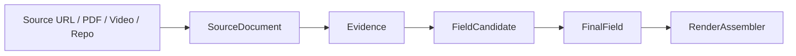
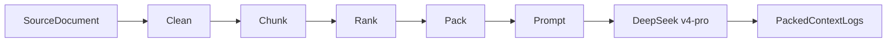

# GZHv3 Phase1-4 总体架构 Spec

## Executive Summary

这份文档面向 **Claude Code + DeepSeek v4-pro** 在 GZHv3 仓库内执行 **Phase1-4** 的整体重构，目标不是“继续加功能”，而是把现有已经跑通的链路——研究、定稿、图片定稿、排版、导出——收敛成四个可独立验收的架构目标：**RenderContract、Evidence Pipeline、Context Governance、Production Stability & Export**。当前仓库已经具备五个 SQLite 数据库、三套卡片规格、`/api/render-data/<company>` 渲染口、证据层迁移 013-032、图片资产契约、排版中心与 Puppeteer PNG 导出等基础，因此最佳策略不是重写，而是通过 **12 个小 PR + 严格 TDD + 明确禁止改动项**，把“输出合同、证据追溯、上下文预算、导出回归”四条主链稳定下来。该策略与仓库现状、Claude Code 的终端内编辑/执行/提交能力，以及 DeepSeek v4-pro 的长上下文、JSON 输出、工具调用与思考模式能力相匹配。citeturn6view0turn7view0turn7view1turn8view0turn8view1turn9view0turn10search2turn10search3turn10search5turn14search1turn14search3

## Goal 一：RenderContract Refactor

### 目标

Goal 一的目标是建立 **唯一的渲染出口**，让 v3 套卡不再依赖“前端自己拼字段、卡片自己查图片、旧接口辅助兜底”的混合模式，而是统一走：

```mermaid
flowchart LR
    A[research_db] --> F[RenderAssembler]
    B[final_db] --> F
    C[assets_db] --> F
    D[composition_db] --> F
    E[template_db] --> F
    F --> G[/api/render-data/<company>?set=v3]
    G --> H[layout]
    G --> I[canvas]
    G --> J[export]
```

这与仓库当前的主链路一致：GZHv3 已经用 Flask + SQLite 跑通研究台、定稿台、卡片制作台和排版中心，而且 `canvas/js/render-data-loader.js` 已优先读取 `/api/render-data/`，只是旧的 legacy 路径仍保留为 fallback。citeturn6view0turn7view0turn8view0turn8view1

### 非目标

本 Goal 明确不做前端重写，不替换 Flask，不替换 SQLite，不重构研究 Agent，不修改 Tavily/DeepSeek 采集与 L0-L3 提取流程，不重做 image-studio、layout、canvas 的 UI 结构。允许保留旧接口，但必须降级为 `legacy/debug` 路径，禁止再作为 v3 主链路输入。这个边界来自当前仓库结构：研究、图片、排版和导出已经存在并可运行，改动重点应放在“合同统一”，而不是“交互翻修”。citeturn6view0turn7view0turn8view0turn8view1

### 数据模型

该 Goal 以 **Contract 优先**，不做大迁移，只新增或固定三个合同文件：`contracts/render_contract.schema.json`、`contracts/asset_keys.json`、`contracts/card_sets/v3.json`。Schema 应采用 **JSON Schema Draft 2020-12**，Python 校验侧使用 `jsonschema` 的 `Draft202012Validator`；这样既与现代 JSON Schema 规范一致，也便于在 pytest 中直接做 schema 断言。citeturn3search1turn11search3

`RenderContract` 的对象结构建议如下：

```json
{
  "$schema": "https://json-schema.org/draft/2020-12/schema",
  "title": "RenderContract",
  "type": "object",
  "required": ["version", "company", "card_set", "cards", "warnings"],
  "properties": {
    "version": { "type": "string" },
    "company": {
      "type": "object",
      "required": ["company_id", "name", "slug"],
      "properties": {
        "company_id": { "type": "string" },
        "name": { "type": "string" },
        "slug": { "type": "string" }
      },
      "additionalProperties": false
    },
    "card_set": { "type": "string", "enum": ["v1", "v2", "v3"] },
    "cards": {
      "type": "array",
      "minItems": 1,
      "items": {
        "type": "object",
        "required": ["card_id", "title", "items", "media", "layout"],
        "properties": {
          "card_id": { "type": "string" },
          "title": { "type": "string" },
          "items": {
            "type": "array",
            "items": {
              "type": "object",
              "required": ["field_key", "value", "status", "confidence", "evidence_count", "source"],
              "properties": {
                "field_key": { "type": "string" },
                "label": { "type": "string" },
                "value": {},
                "status": {
                  "type": "string",
                  "enum": [
                    "confirmed",
                    "derived",
                    "proxy",
                    "llm_extracted",
                    "manual_needed",
                    "unavailable",
                    "not_applicable"
                  ]
                },
                "confidence": { "type": "number", "minimum": 0, "maximum": 1 },
                "evidence_count": { "type": "integer", "minimum": 0 },
                "source": { "type": "string" }
              },
              "additionalProperties": false
            }
          },
          "media": {
            "type": "array",
            "items": {
              "type": "object",
              "required": ["asset_key", "url", "status", "source"],
              "properties": {
                "asset_key": { "type": "string" },
                "url": { "type": ["string", "null"] },
                "status": {
                  "type": "string",
                  "enum": ["ready", "fallback", "manual_needed", "unavailable", "not_applicable"]
                },
                "source": { "type": "string" }
              },
              "additionalProperties": false
            }
          },
          "layout": {
            "type": "object",
            "required": ["template_id", "variant"],
            "properties": {
              "template_id": { "type": "string" },
              "variant": { "type": "string" }
            },
            "additionalProperties": true
          }
        },
        "additionalProperties": false
      }
    },
    "warnings": { "type": "array", "items": { "type": "string" } }
  },
  "additionalProperties": false
}
```

`asset_keys.json` 示例片段：

```json
{
  "logo": { "type": "image", "required": true },
  "website_screenshot": { "type": "image", "required": false },
  "product_main": { "type": "image", "required": false },
  "founder_photo": { "type": "image", "required": false },
  "customer_logos": {
    "type": "composite_image",
    "required": false,
    "fallback": "customer_name_list_text_card"
  },
  "chart_competitive": { "type": "chart", "required": false },
  "chart_ecosystem": { "type": "chart", "required": false },
  "flywheel": { "type": "chart", "required": false },
  "timeline": { "type": "chart", "required": false }
}
```

这里特意补入 `customer_logos`，因为当前仓库公开的 `media.json` 已有 12 类媒体键，但仍主要是 `logo / website_screenshot / founder_photo / product_main / competitors / flywheel / timeline / chart_competitive / chart_ecosystem` 等，v3 若直接引用客户 Logo 需要单独注册才能避免卡片契约与资产契约失配。citeturn9view0turn8view1

`contracts/card_sets/v3.json` 示例片段：

```json
{
  "card_set": "v3",
  "cards": [
    {
      "card_id": "v3_card_01",
      "title": "封面",
      "fields": ["company_name", "company_type", "one_line_positioning"],
      "media": ["logo"]
    },
    {
      "card_id": "v3_card_02",
      "title": "公司简介",
      "fields": [
        "market_landscape",
        "market_size",
        "cagr",
        "tam",
        "location",
        "founded_year",
        "core_business",
        "funding",
        "key_achievements",
        "company_position"
      ],
      "media": ["website_screenshot"]
    },
    {
      "card_id": "v3_card_05",
      "title": "用户群体",
      "fields": [
        "ideal_customer_profile",
        "primary_customer_segment",
        "secondary_customer_segment",
        "named_customers",
        "customer_evidence"
      ],
      "media": ["customer_logos"]
    }
  ]
}
```

### API Contract

核心 API 只保留一个主出口：

```http
GET /api/render-data/<company>?set=v3
```

响应示例：

```json
{
  "version": "1.0",
  "company": {
    "company_id": "anthropic",
    "name": "Anthropic",
    "slug": "anthropic"
  },
  "card_set": "v3",
  "cards": [
    {
      "card_id": "v3_card_01",
      "title": "封面",
      "items": [
        {
          "field_key": "company_name",
          "label": "公司名称",
          "value": "Anthropic",
          "status": "confirmed",
          "confidence": 0.95,
          "evidence_count": 3,
          "source": "final"
        }
      ],
      "media": [
        {
          "asset_key": "logo",
          "url": "/assets/anthropic/logo.png",
          "status": "ready",
          "source": "selected_asset"
        }
      ],
      "layout": {
        "template_id": "v3_default",
        "variant": "wide"
      }
    }
  ],
  "warnings": []
}
```

该 API 的组装逻辑统一进入 `webapp/services/render_assembler.py`，并由 `webapp/services/contract_validator.py` 负责 Schema 校验。这样可以把当前分散在 `app.py`、legacy loader、canvas loader、layout overrides 之间的结构差异收敛为单一 Contract。现有架构文档也已说明 `canvas`、`layout`、`single-card` 页面在动态路径下都优先读取 `/api/render-data/`。citeturn8view0turn8view1

### TDD 测试清单

下表给出 Goal 一至少 12 个测试；其中前 8 个建议为单元测试，后 4 个建议为集成测试。

| 测试名称 | 目的 | 输入 | 预期输出 | 优先级 |
|---|---|---|---|---|
| `test_render_contract_schema_valid_contract` | 验证合法 Contract 通过 Schema | 合法 fixture JSON | 无异常 | P0 |
| `test_render_contract_schema_missing_cards` | 强制 `cards` 为必填 | 删除 `cards` | `ValidationError` | P0 |
| `test_render_contract_schema_invalid_item_status` | 防止非法字段状态进入渲染 | `status="unknown"` | `ValidationError` | P0 |
| `test_render_contract_schema_invalid_media_status` | 防止非法媒体状态进入渲染 | `status="broken"` | `ValidationError` | P0 |
| `test_asset_registry_contains_all_v3_media_keys` | 确保 v3 媒体键全部注册 | `v3.json + asset_keys.json` | 全部匹配 | P0 |
| `test_asset_registry_customer_logos_exists` | 修复客户 Logo 槽缺失 | 查找 `customer_logos` | 存在 | P0 |
| `test_v3_composition_has_exactly_8_cards` | 固化 v3 卡片数 | 读取 `v3.json` | 长度为 8 | P0 |
| `test_v3_composition_card_ids_unique` | 防止重复 `card_id` | 读取 `v3.json` | 无重复 | P0 |
| `test_render_assembler_prefers_final_value` | 保证 final 优先于 research | 同字段有 final 与 candidate | 取 final | P0 |
| `test_render_assembler_missing_private_metric_unavailable` | 禁止私有指标乱填 | `retention` 无可靠来源 | `unavailable/manual_needed` | P0 |
| `test_render_assembler_missing_media_returns_fallback` | 缺图不崩溃 | 缺少 `customer_logos` | `fallback/manual_needed` | P0 |
| `test_render_api_returns_valid_v3_contract` | 端到端验证主出口 | GET `/api/render-data/Anthropic?set=v3` | 200，8 张卡，Schema 通过 | P0 |

建议测试文件：

```text
tests/test_render_contract_schema.py
tests/test_asset_key_registry.py
tests/test_v3_composition_contract.py
tests/test_render_assembler.py
tests/test_render_api.py
```

pytest 的 plain `assert`、自动发现、fixture 机制和 `tmp_path` 都适合这个阶段的 TDD；同时，如果测试需要短生命周期数据库，SQLite 的 `:memory:` 或 `file::memory:?cache=shared` 很适合构建快照式 fixture。citeturn3search2turn12search0turn12search7

### 验收标准

Goal 一完成时，必须满足以下硬标准：一是 `contracts/render_contract.schema.json`、`contracts/asset_keys.json`、`contracts/card_sets/v3.json` 存在并被代码真正读取；二是 `/api/render-data/<company>?set=v3` 返回的 `cards.length` 固定为 8；三是字段状态只能来自白名单；四是 `customer_logos` 等媒体键都已经注册；五是缺字段与缺图片不会导致接口 traceback，而是以 `manual_needed/unavailable/fallback` 的显式状态返回；六是新增测试全部通过。当前仓库 README 已明确 `canvas` 与 `layout` 都围绕 `/api/render-data/` 工作，因此 Goal 一的“完成”不是“新增一个接口”，而是“让这个接口成为唯一可信主出口”。citeturn6view0turn8view0

### 迁移策略

迁移策略坚持“小步替换，不删旧表”。具体做法是：先增 Contract，再增 Validator，再增 Assembler，最后将 `/api/render-data` 接管到 Assembler。旧的 `/api/final/export`、legacy renderer、`canvas/js/api-loader.js` 只保留 fallback 或 debug 角色；如果发现旧数据不完整，不做一次性清洗，而在 Assembler 内兼容读取并统一下沉为 `manual_needed/unavailable`。这样既符合 SQLite 轻量迁移的特点，也降低了一次性替换五个数据库读路径的风险。SQLite 官方文档也强调，外键需要在每个连接上显式开启，因此对应测试环境和生产环境都应明确启用 `PRAGMA foreign_keys = ON`。citeturn4search1

### 风险与缓解

最大风险是 **同名字段在 research/final/composition/layout 四层同时存在解释权**。缓解方式是强制规定：字段值解释权只属于 final layer；卡片只引用 `field_key`；图片只引用 `asset_key`；layout 只做文字位置与样式 override，不再承担字段来源逻辑。第二风险是前端仍偷偷读取旧接口，缓解方式是将所有 v3 页面切换到新 Contract，同时在 legacy 接口加日志提示。第三风险是测试过于依赖真实数据库，缓解方式是使用 `tmp_path`、SQLite in-memory、短 fixture company 来运行。citeturn8view0turn12search0turn12search7

### Checkpoint

Goal 一建议分 3 个 checkpoint：第一阶段完成三个合同文件与 Schema 测试；第二阶段完成 `contract_validator.py` 与 `render_assembler.py`，让单元测试通过；第三阶段接管 `/api/render-data`，跑完 API 集成测试后提交。每个 checkpoint 都必须输出 `git diff --stat`、失败测试列表与通过测试列表，并在 commit message 中清楚标注范围，例如 `feat: add render contract specs and tests`、`feat: implement render assembler`、`feat: migrate render-data to assembler`。

## Goal 二：Evidence Pipeline Refactor

### 目标

Goal 二的目标是把当前“研究结果直接落字段”的做法，改造成 **Evidence-First** 的研究架构：



这一步不是为了多一个“证据页面”，而是为了让任何一个最终字段都能解释 **来自哪里、有哪些候选值、为什么选这个值、为什么拒绝其他值**。当前仓库已经有 evidence 相关迁移、`evidence_items`、`research_fields` 的状态标记、`field_resolution_logs` 和 013-032 的证据层迁移，这说明基础已经在，只是模型与接口还没有被明确收敛。citeturn7view0turn7view1turn8view0

### 非目标

Goal 二不改 RenderContract，不改排版，不改导出，不替换 DeepSeek/Tavily，不改图像采集，不做新的 UI 框架，不要求在本阶段把 editor 整体改造成证据审计台。其边界是：**Goal 二只负责生产稳定的 FinalField 语义层，并为 Goal 一提供更可信的输入。**

### 数据模型

建议在 `research_db` 上采用以下 Evidence Schema。SQLite `CREATE TABLE`、主键、唯一约束、外键和索引都可直接实现，但注意 SQLite 外键默认关闭，需要显式开启。citeturn4search0turn4search1

`source_documents`：

```sql
CREATE TABLE IF NOT EXISTS source_documents (
    document_id TEXT PRIMARY KEY,
    company_id TEXT NOT NULL,
    source_url TEXT NOT NULL,
    source_type TEXT NOT NULL,
    title TEXT,
    published_at TEXT,
    content_hash TEXT NOT NULL,
    created_at TEXT NOT NULL DEFAULT CURRENT_TIMESTAMP
);
CREATE INDEX IF NOT EXISTS idx_source_documents_company
ON source_documents(company_id);
```

`evidence_items`：

```sql
CREATE TABLE IF NOT EXISTS evidence_items (
    evidence_id TEXT PRIMARY KEY,
    document_id TEXT NOT NULL,
    excerpt TEXT NOT NULL,
    start_offset INTEGER,
    end_offset INTEGER,
    confidence REAL NOT NULL DEFAULT 0.0,
    created_at TEXT NOT NULL DEFAULT CURRENT_TIMESTAMP,
    FOREIGN KEY(document_id) REFERENCES source_documents(document_id)
);
CREATE INDEX IF NOT EXISTS idx_evidence_items_document
ON evidence_items(document_id);
```

`field_candidates`：

```sql
CREATE TABLE IF NOT EXISTS field_candidates (
    candidate_id TEXT PRIMARY KEY,
    company_id TEXT NOT NULL,
    field_key TEXT NOT NULL,
    candidate_value TEXT NOT NULL,
    source_type TEXT NOT NULL,
    confidence REAL NOT NULL DEFAULT 0.0,
    status TEXT NOT NULL CHECK (status IN ('candidate','approved','rejected')),
    reject_reason TEXT,
    created_at TEXT NOT NULL DEFAULT CURRENT_TIMESTAMP
);
CREATE INDEX IF NOT EXISTS idx_field_candidates_company_field
ON field_candidates(company_id, field_key);
```

`candidate_evidence_map`：

```sql
CREATE TABLE IF NOT EXISTS candidate_evidence_map (
    candidate_id TEXT NOT NULL,
    evidence_id TEXT NOT NULL,
    PRIMARY KEY(candidate_id, evidence_id),
    FOREIGN KEY(candidate_id) REFERENCES field_candidates(candidate_id),
    FOREIGN KEY(evidence_id) REFERENCES evidence_items(evidence_id)
);
```

`final_field_values`：

```sql
CREATE TABLE IF NOT EXISTS final_field_values (
    company_id TEXT NOT NULL,
    field_key TEXT NOT NULL,
    selected_candidate_id TEXT,
    field_status TEXT NOT NULL CHECK (
      field_status IN (
        'confirmed','derived','proxy','llm_extracted',
        'manual_needed','unavailable','not_applicable'
      )
    ),
    updated_at TEXT NOT NULL DEFAULT CURRENT_TIMESTAMP,
    PRIMARY KEY(company_id, field_key),
    FOREIGN KEY(selected_candidate_id) REFERENCES field_candidates(candidate_id)
);
CREATE INDEX IF NOT EXISTS idx_final_field_values_candidate
ON final_field_values(selected_candidate_id);
```

该设计的关键点是 **FinalField 不直接存自由字符串 value，而是优先引用 `selected_candidate_id`**。只有对纯人工 override 或纯公式推导字段，才允许在服务层做兼容封装。这样可以最大化保留 lineage。现有 runbook 已经列出 013 `source_documents`、015 `field_candidates`、016 `final_card_values`、032 `packed_context_logs` 等迁移名，说明在本仓库上下文中扩展这组结构是自然且低冲突的。citeturn7view1

### API Contract

建议新增三个 Evidence API：

```http
GET /api/evidence/company/<company>
GET /api/evidence/field/<company>/<field_key>
GET /api/evidence/candidate/<candidate_id>
```

返回示例：

```json
{
  "company": "Anthropic",
  "field_key": "market_size",
  "final_candidate": {
    "candidate_id": "cand_001",
    "value": "$61B",
    "status": "approved",
    "score": 128.4
  },
  "alternatives": [
    {
      "candidate_id": "cand_002",
      "value": "$42B",
      "status": "rejected",
      "reject_reason": "outdated"
    }
  ],
  "evidence": [
    {
      "evidence_id": "ev_009",
      "excerpt": "The generative AI market is projected to reach ...",
      "source_url": "https://...",
      "source_type": "official_report",
      "published_at": "2025-11-01"
    }
  ]
}
```

同时在服务层新增：

```python
get_field_candidates(company_id, field_key)
get_field_evidence(company_id, field_key)
resolve_best_candidate(company_id, field_key)
get_candidate_lineage(candidate_id)
```

Candidate Resolver 的分数建议采用：

```text
Score = SourceWeight + EvidenceWeight + RecencyWeight + ConfidenceWeight
```

其中 `SourceWeight` 的建议顺序为：官网/官方文档 > 创始人访谈 > Investor Deck > Crunchbase > LinkedIn > 主流媒体 > 行业博客 > 论坛 > 纯 LLM 推断。这个顺序不是硬编码的事实标准，而是面向“公开商业研究”的工程启发式，用于让系统优先相信官方和高质量来源。当前仓库对字段“confirmed/derived/proxy/unavailable/manual_needed/not_applicable/llm_extracted”已有公开状态体系，因此 Goal 二的 Resolver 必须与之保持兼容。citeturn8view0

### TDD 测试清单

Goal 二建议至少 12 个测试，其中单元测试围绕 Resolver 和状态机，集成测试围绕 Evidence API 和 lineage。

| 测试名称 | 目的 | 输入 | 预期输出 | 优先级 |
|---|---|---|---|---|
| `test_candidate_resolver_prefers_official_source` | 官方来源高于博客 | 官网候选 vs 博客候选 | 官网 candidate 胜出 | P0 |
| `test_candidate_resolver_prefers_more_evidence` | 多证据优先 | 1 条证据 vs 3 条证据 | 3 条证据 candidate 胜出 | P0 |
| `test_candidate_resolver_prefers_recent_candidate` | 新数据优先 | 2024 候选 vs 2026 候选 | 2026 candidate 胜出 | P0 |
| `test_candidate_resolver_keeps_conflicting_values` | 冲突不覆盖 | 1M / 2M / 3M | 全部保留为 alternatives | P0 |
| `test_candidate_resolver_reject_reason_required` | 被拒绝必须说明原因 | rejected candidate 无 reason | 断言失败 | P0 |
| `test_field_status_confirmed_requires_evidence` | confirmed 需有证据 | approved candidate 无 evidence | 不得为 confirmed | P0 |
| `test_field_status_unavailable_for_private_metric` | 私有指标默认不可得 | retention 无公开来源 | `unavailable` | P0 |
| `test_evidence_service_returns_lineage` | 返回完整链路 | candidate_id | field→candidate→evidence→document | P0 |
| `test_evidence_service_handles_missing_candidate` | 缺 candidate 不崩溃 | 不存在 field | 空数组/空对象 | P0 |
| `test_evidence_api_company_returns_json` | 公司级 API 可用 | GET `/api/evidence/company/Anthropic` | 200 + JSON | P0 |
| `test_evidence_api_field_returns_alternatives` | 字段 API 返回候选与最终值 | GET field endpoint | `final_candidate` + `alternatives` | P0 |
| `test_render_assembler_consumes_final_candidate_reference` | Goal 二不破坏 Goal 一 | selected_candidate_id 存在 | RenderAssembler 正常解引用 | P0 |

建议测试文件：

```text
tests/test_candidate_resolver.py
tests/test_evidence_service.py
tests/test_field_status.py
tests/test_candidate_lineage.py
tests/test_conflict_resolution.py
tests/test_evidence_api.py
```

### 验收标准

Goal 二完成时，系统必须能稳定回答五个问题：**这个字段来自哪里；有哪些候选值；为什么选这个值；为什么拒绝其他值；有哪些证据支持它。** 如果任何一个核心字段无法回答这五个问题，Goal 二只能算“部分完成”。同时，RenderContract 的字段解析路径必须从“直接读 research string”迁移为“优先读 selected_candidate_id 解引用后的 final value”，但对旧记录仍允许兼容 fallback。这个结果与当前仓库“evidence_items + research_fields 状态 + field_resolution_logs”的方向一致，只是把它正式化。citeturn8view0turn7view1

### 迁移策略

迁移时只允许 **新增表、新增索引、新增列**，不允许删除旧表或一次性重写历史记录。旧 `final_fields/final_card_values` 可保留，并在读路径中加一个 Adapter：若有 `selected_candidate_id` 则优先走新链路；否则走旧值并标记 `legacy_value` 来源。SQLite 的 ALTER TABLE 和外键行为在复杂修改上相对保守，因此“只增不删”的迁移策略更适合这个仓库。citeturn3search11turn4search0

### 风险与缓解

最大风险是 Candidate Resolver 变成“隐式第二个 LLM”，即在缺证据时偷偷推断。缓解方式是把“confirmed/derived/proxy/llm_extracted/unavailable”严格区分，并在测试中直接堵死“无 evidence 仍 confirmed”的路径。第二风险是 lineage 查询跨表过多导致代码复杂，缓解方式是集中在 `services/evidence_service.py` 中封装，并为 API 暴露只读 DTO。第三风险是历史数据不足导致很多字段从 confirmed 变成 unavailable，这实际上是正确暴露系统诚实度，而不是失败。

### Checkpoint

Goal 二建议 3 个 checkpoint：先完成 DB schema 与迁移测试；再完成 Resolver 与 Service 测试；最后完成 API 与 RenderAssembler 兼容测试。每一步都要有单独 commit，例如 `feat: add evidence schema and migrations`、`feat: implement candidate resolver and lineage service`、`feat: add evidence apis and integrate final candidate resolution`。

## Goal 三：Context Governance

### 目标

Goal 三的目标是建立 **LLM 上下文治理层**，把当前可能出现的“原文直接塞模型”的路径改造成：



当前仓库 runbook 已经明确存在 `DOCUMENT_CHUNKING_ENABLED=1`、`CONTEXT_PACKER_ENABLED=1`、`RAW_TEXT_IN_LLM_ENABLED=0`、`L0_CONTEXT_BUDGET_TOKENS=18000`，并说明深度模式可提升到 28000；这意味着 Goal 三不是凭空设计，而是把已经开始的治理参数固化成真正的服务与测试。citeturn7view1

### 非目标

Goal 三不重写 Prompt，不更换 LLM，不引入新的检索供应商，不重新设计研究 UI，不要求在此阶段优化模型质量到“最优”。边界只覆盖：**规范化 chunk、rank、pack、budget、log**。

### 数据模型

建议新增 `document_chunks` 与 `packed_context_logs` 读写规范，沿用 runbook 中 031-032 迁移方向。`packed_context_logs` 表示例：

```sql
CREATE TABLE IF NOT EXISTS packed_context_logs (
    log_id TEXT PRIMARY KEY,
    run_id TEXT NOT NULL,
    company_id TEXT NOT NULL,
    stage TEXT NOT NULL,
    model_name TEXT NOT NULL,
    input_tokens INTEGER NOT NULL DEFAULT 0,
    output_tokens INTEGER NOT NULL DEFAULT 0,
    selected_chunks_json TEXT NOT NULL,
    dropped_chunks_json TEXT NOT NULL,
    pack_reason TEXT,
    created_at TEXT NOT NULL DEFAULT CURRENT_TIMESTAMP
);
CREATE INDEX IF NOT EXISTS idx_packed_context_logs_run_stage
ON packed_context_logs(run_id, stage);
```

`document_chunks` 最小示例：

```sql
CREATE TABLE IF NOT EXISTS document_chunks (
    chunk_id TEXT PRIMARY KEY,
    document_id TEXT NOT NULL,
    company_id TEXT NOT NULL,
    section_title TEXT,
    chunk_text TEXT NOT NULL,
    token_count INTEGER NOT NULL,
    chunk_order INTEGER NOT NULL,
    created_at TEXT NOT NULL DEFAULT CURRENT_TIMESTAMP,
    FOREIGN KEY(document_id) REFERENCES source_documents(document_id)
);
CREATE INDEX IF NOT EXISTS idx_document_chunks_document
ON document_chunks(document_id);
```

SQLite 用于这类本地日志表很合适，因为它本身就是单文件、嵌入式、零配置数据库，且官方明确支持纯内存数据库做测试。citeturn12search0turn12search2

### API Contract

Goal 三可不一定对外开放 HTTP API，但至少需要下列内部 contract：

```yaml
context_budget:
  l0_standard: 18000
  l0_deep: 28000
  l1: 18000
  l2: 18000
  l3: 18000
  raw_text_in_llm: false
  document_chunking_enabled: true
  context_packer_enabled: true
```

`ContextPacker.pack()` 的返回建议：

```json
{
  "stage": "L0",
  "budget_tokens": 18000,
  "selected_chunks": [
    { "chunk_id": "ch_001", "score": 0.98, "token_count": 420 },
    { "chunk_id": "ch_009", "score": 0.94, "token_count": 510 }
  ],
  "dropped_chunks": [
    { "chunk_id": "ch_041", "reason": "low_score" }
  ],
  "packed_text": "..."
}
```

DeepSeek v4-pro 官方文档说明其支持 **1M context、JSON Output、Tool Calls**，并且 thinking mode 在复杂 agent 请求下默认会提高 effort；同时 thinking mode 下 `temperature/top_p/presence_penalty/frequency_penalty` 实际不会生效。这意味着 Goal 三应尽量把“输入质量治理”前移到代码层，而不是寄希望于运行时随机采样参数。citeturn10search2turn10search3turn10search5

### TDD 测试清单

| 测试名称 | 目的 | 输入 | 预期输出 | 优先级 |
|---|---|---|---|---|
| `test_chunker_splits_large_document` | 长文档必须切块 | 50k 文本 | 多个 chunk | P0 |
| `test_chunker_preserves_order` | 保留原始顺序 | 多段文本 | `chunk_order` 连续 | P0 |
| `test_ranker_scores_company_specific_chunks_higher` | 公司相关块更高分 | 公司官网段 vs 泛行业段 | 官网段分更高 | P0 |
| `test_packer_respects_budget_l0_standard` | 标准 L0 不超预算 | 多个 chunk，budget=18000 | `input_tokens<=18000` | P0 |
| `test_packer_respects_budget_l0_deep` | deep L0 不超预算 | budget=28000 | `input_tokens<=28000` | P0 |
| `test_packer_rejects_raw_text_when_disabled` | 禁止 raw text 直入 | `RAW_TEXT_IN_LLM_ENABLED=0` | 抛异常/拦截 | P0 |
| `test_packer_prefers_high_rank_chunks` | 按分数取块 | chunks with scores | 高分先入选 | P0 |
| `test_packer_logs_selected_and_dropped_chunks` | 保留审计日志 | 运行 pack | log 表含 selected/dropped | P0 |
| `test_context_log_contains_stage_and_model` | 日志可审计模型与阶段 | L1 输入 | stage/model_name 存在 | P0 |
| `test_pipeline_uses_context_packer_when_enabled` | 流水线接管成功 | feature flag on | 调用 packer | P0 |
| `test_pipeline_bypasses_packer_only_in_explicit_legacy_mode` | 禁止隐式绕过 | legacy off | 不允许绕过 | P0 |
| `test_end_to_end_research_never_sends_raw_text` | 端到端阻断原文直入 | mock L0 run | 断言 prompt 只含 packed_text | P0 |

建议测试文件：

```text
tests/test_document_chunker.py
tests/test_context_ranker.py
tests/test_context_packer.py
tests/test_context_logs.py
tests/test_pipeline_context_integration.py
tests/test_no_raw_text_in_llm.py
```

### 验收标准

Goal 三完成后，必须可以证明四点：第一，L0/L1/L2/L3 输入都在预算内；第二，原文文本不会再直接进入模型；第三，所有 pack 结果都可在 `packed_context_logs` 中找到审计记录；第四，关闭 packer 和 chunker 必须是显式 feature flag，而不是默默绕过。如果无法在日志中重建某次 LLM 输入由哪些 chunk 组成，Goal 三就不算完成。当前 runbook 已经把相关环境变量列出来，因此这里的核心工作是 **把环境变量变成具体验证逻辑**。citeturn7view1

### 迁移策略

先新增 `document_chunks` 和 `packed_context_logs` 及其测试，再在 `pipeline.py` 中把 L0-L3 输入改为“先 chunk/rank/pack 再 prompt”。老逻辑仅允许保留 `LEGACY_CONTEXT_MODE=1` 之类的显式开关。由于 DeepSeek thinking mode 对复杂 agent 请求的 effort 会提升，因此更应该用 BudgetManager 控制输入上限，而不是用口头约定。citeturn10search5

### 风险与缓解

最大风险是“pack 后损失信号，研究质量下降”。缓解方式不是回退到 raw_text，而是通过 `rank features + whitelist intents + selected/dropped logs` 逐步调参。第二风险是日志太多影响性能，缓解方式是只记录 chunk ID、token、score、理由，不必存完整大文本。第三风险是 packer 自身变得过重，因此需要将其视为纯服务层逻辑，不在 Flask handler 中写复杂流程。

### Checkpoint

Goal 三建议 3 个 checkpoint：先完成 chunk schema 与 packer 单元测试；再完成日志表与流水线集成测试；最后在真实公司样本上跑一次深度研究并输出 token 审计摘要。commit 建议：`feat: add chunk and context log schemas`、`feat: implement context packer and budget manager`、`feat: integrate context governance into pipeline`。

## Goal 四：Production Stability 与 Export

### 目标

Goal 四的目标是把已经存在的“研究→定稿→排版→PNG 导出”链路变成 **可回归、可监控、可验收** 的生产路径，而不是“某次能跑通”。当前仓库 README 和架构文档都已明确，排版中心、卡片制作台、Puppeteer CLI 导出已经存在；Goal 四的重点在于为它们补充覆盖率检查、资产完整性检查和导出回归。citeturn6view0turn8view0turn8view1turn3search0

### 非目标

Goal 四不重做模板系统，不改 HTML/CSS renderer，不引入新的浏览器自动化库，不重构所有导出 UI。它只解决“如何证明整条链稳定”。

### 数据模型

Goal 四以脚本与测试为主，可选新增一张导出审计表：

```sql
CREATE TABLE IF NOT EXISTS export_runs (
    export_run_id TEXT PRIMARY KEY,
    company_id TEXT NOT NULL,
    card_set TEXT NOT NULL,
    requested_cards_json TEXT NOT NULL,
    format TEXT NOT NULL,
    scale REAL NOT NULL DEFAULT 2.0,
    status TEXT NOT NULL,
    output_dir TEXT,
    error_message TEXT,
    created_at TEXT NOT NULL DEFAULT CURRENT_TIMESTAMP
);
CREATE INDEX IF NOT EXISTS idx_export_runs_company
ON export_runs(company_id, created_at);
```

更关键的是两个检查脚本契约：

`CardCoverageCheck` 负责验证：
1. 每张 card 是否有 items；
2. 每个 field_key 是否可由 RenderAssembler 解析；
3. required media 是否有状态；
4. layout 是否完整。

`ExportRegression` 负责验证：
1. 给定公司与 card_set 是否能生成全部 PNG；
2. 输出目录中文件数量是否等于启用卡片数；
3. 文件大小不为 0；
4. 可选地检查关键 DOM selector 或截图尺寸。

Puppeteer 官方文档确认 `Page.screenshot()` 和 `ElementHandle.screenshot()` 是标准截图路径，因此沿用当前 Puppeteer CLI 是合理的。citeturn3search0turn3search6turn3search9

### API Contract

此 Goal 可以不增加公开 API，但需要固化命令行与脚本契约：

```bash
python3 scripts/card_content_coverage_check.py --company Anthropic --set v3
python3 scripts/asset_coverage_check.py --company Anthropic --set v3
node canvas/screenshot.js --company Anthropic --set v3 --base-url http://127.0.0.1:5050
python3 scripts/export_regression.py --companies Anthropic OpenAI Cursor Perplexity --set v3
```

输出 JSON 结构建议统一为：

```json
{
  "ok": true,
  "company": "Anthropic",
  "card_set": "v3",
  "summary": {
    "cards_expected": 8,
    "cards_renderable": 8,
    "assets_missing": 1,
    "exports_written": 8
  },
  "failures": []
}
```

### TDD 测试清单

| 测试名称 | 目的 | 输入 | 预期输出 | 优先级 |
|---|---|---|---|---|
| `test_card_coverage_detects_missing_field` | 缺字段能被发现 | 少一个 field item | fail | P0 |
| `test_card_coverage_passes_complete_v3` | 完整 v3 通过 | 完整 render data | pass | P0 |
| `test_asset_coverage_detects_unregistered_asset_key` | 未注册 asset 不允许导出 | `foo_asset` | fail | P0 |
| `test_asset_coverage_detects_required_logo_missing` | 必需 Logo 缺失报错 | 缺 logo | fail | P0 |
| `test_asset_coverage_allows_optional_fallback_media` | 可选媒体允许 fallback | `customer_logos=fallback` | pass | P0 |
| `test_export_regression_writes_expected_png_count` | 输出数量正确 | 8 cards | 8 png | P0 |
| `test_export_regression_png_size_nonzero` | 文件非空 | 生成 png | size > 0 | P0 |
| `test_export_regression_returns_nonzero_on_render_error` | 渲染错误可感知 | mock broken template | process fail | P0 |
| `test_layout_export_uses_render_data_contract` | 导出路径走新合同 | v3 company | hit `/api/render-data` | P0 |
| `test_canvas_preview_matches_enabled_card_count` | 预览卡数与配置一致 | enabled cards=6 | preview=6 | P1 |
| `test_smoke_anthropic_v3_export` | 样本烟雾测试 | Anthropic v3 | pass | P0 |
| `test_smoke_openai_cursor_perplexity_export` | 多公司回归 | 4 companies | 全部 pass | P0 |

建议测试文件：

```text
tests/test_card_coverage.py
tests/test_asset_coverage.py
tests/test_export_regression.py
tests/test_render_export_integration.py
tests/test_smoke_exports.py
```

### 验收标准

Goal 四完成时，至少要达到三类稳定性结果。第一类是合同稳定性：RenderContract、AssetRegistry、Composition 不会再随页面切换而漂移。第二类是导出稳定性：以 Anthropic、OpenAI、Cursor、Perplexity 作为回归样本，v3 能在本地完整导出。第三类是失败可观测性：如果某张卡缺字段、缺图或模板报错，测试和脚本会明确指出公司、卡片 ID、失败原因，而不是留给人工肉眼排查。仓库当前已保留命令行 `node canvas/screenshot.js --company <公司> --set v1|v2|v3` 路径，这非常适合作为回归入口。citeturn8view1turn7view0

### 迁移策略

先加 coverage 脚本，再加回归测试，最后再加导出审计表或 CLI 结果 JSON。不要先做 Dashboard；先让命令可跑、结果可断言。对于真实公司样本，建议固定使用少量高稳定公司 fixture，不要把外部研究实时结果作为导出 CI 的唯一输入，否则波动大。

### 风险与缓解

最大风险是导出回归测试被外部不稳定因素拖垮，例如网络、截图时序、第三方站点反爬。缓解方式是导出阶段只基于本地 Flask 输出与本地图像资产，不在回归阶段重新抓网页。第二风险是“通过了导出，但内容缺失”；缓解方式是 coverage 检查先于 export regression 运行。第三风险是截图尺寸或渲染 wait 条件不稳定；缓解方式是明确 Puppeteer 的等待条件与超时，并把输出目录、文件计数、文件大小纳入断言。citeturn3search0turn3search6

### Checkpoint

Goal 四建议 3 个 checkpoint：先完成 coverage 检查与单元测试；再完成 Puppeteer 回归脚本；最后跑多公司 smoke suite。commit 建议：`feat: add card and asset coverage checks`、`feat: add export regression suite`、`feat: add production smoke commands and export audit`。

## 十二个 PR 执行清单

下表按“小 PR，高成功率”组织，每个 PR 都必须先写测试、先跑出失败、再实现，直到测试通过后再进下一个 PR。

| PR 名称 | 改动文件 | 测试文件 | 验收命令 | 估计工时 |
|---|---|---|---|---:|
| PR1 Render Schema | `contracts/render_contract.schema.json` `tests/test_render_contract_schema.py` | `tests/test_render_contract_schema.py` | `pytest tests/test_render_contract_schema.py -v` | 0.5d |
| PR2 Asset Registry | `contracts/asset_keys.json` `tests/test_asset_key_registry.py` | `tests/test_asset_key_registry.py` | `pytest tests/test_asset_key_registry.py -v` | 0.5d |
| PR3 V3 Composition | `contracts/card_sets/v3.json` `tests/test_v3_composition_contract.py` | `tests/test_v3_composition_contract.py` | `pytest tests/test_v3_composition_contract.py -v` | 0.5d |
| PR4 Render Validator | `webapp/services/contract_validator.py` `tests/test_render_contract_schema.py` | `tests/test_render_contract_schema.py` | `pytest tests/test_render_contract_schema.py -v` | 0.5d |
| PR5 Render Assembler + API | `webapp/services/render_assembler.py` `webapp/app.py` `tests/test_render_assembler.py` `tests/test_render_api.py` | `tests/test_render_assembler.py` `tests/test_render_api.py` | `pytest tests/test_render_assembler.py tests/test_render_api.py -v` | 1.0d |
| PR6 Evidence Migrations | `db/migrations/*evidence*.sql` `tests/test_evidence_schema.py` | `tests/test_evidence_schema.py` | `pytest tests/test_evidence_schema.py -v` | 0.75d |
| PR7 Candidate Resolver | `webapp/services/candidate_resolver.py` `webapp/services/evidence_service.py` | `tests/test_candidate_resolver.py` `tests/test_evidence_service.py` | `pytest tests/test_candidate_resolver.py tests/test_evidence_service.py -v` | 1.0d |
| PR8 Evidence API + Lineage | `webapp/routes/evidence.py` `webapp/app.py` | `tests/test_evidence_api.py` `tests/test_candidate_lineage.py` | `pytest tests/test_evidence_api.py tests/test_candidate_lineage.py -v` | 0.75d |
| PR9 Context Schema + Packer | `db/migrations/031_document_chunks.sql` `db/migrations/032_packed_context_logs.sql` `webapp/services/context_packer.py` | `tests/test_document_chunker.py` `tests/test_context_packer.py` | `pytest tests/test_document_chunker.py tests/test_context_packer.py -v` | 1.0d |
| PR10 Context Integration | `webapp/pipeline.py` `webapp/services/context_ranker.py` `webapp/services/budget_manager.py` | `tests/test_context_logs.py` `tests/test_pipeline_context_integration.py` `tests/test_no_raw_text_in_llm.py` | `pytest tests/test_context_logs.py tests/test_pipeline_context_integration.py tests/test_no_raw_text_in_llm.py -v` | 1.0d |
| PR11 Coverage Checks | `scripts/card_content_coverage_check.py` `scripts/asset_coverage_check.py` | `tests/test_card_coverage.py` `tests/test_asset_coverage.py` | `pytest tests/test_card_coverage.py tests/test_asset_coverage.py -v` | 0.75d |
| PR12 Export Regression | `scripts/export_regression.py` `tests/test_export_regression.py` `tests/test_smoke_exports.py` | `tests/test_export_regression.py` `tests/test_smoke_exports.py` | `pytest tests/test_export_regression.py tests/test_smoke_exports.py -v` | 0.75d |

如果每个 PR 都严格限定在以上改动范围内，且不跨越多个 Goal 做“顺手优化”，那么这是对 Claude Code 最友好的工作拆分。Claude Code 的 CLI 支持 `--max-turns`、`--permission-mode plan`、`-p` print mode 等能力，适合把每个 PR 变成一次明确的、可收敛的执行任务。citeturn14search1turn13search0

## Claude Code 与 DeepSeek v4-pro 的能力假设与边界

**能力假设** 部分应直接写入 `docs/refactor/goal1-4_spec.md` 的前置说明中。第一，Claude Code 假定能够在本地仓库内读取文件、修改文件、执行 shell 命令、运行测试、做 git 提交；Anthropic 文档也明确说明 Claude Code 在终端内工作、可进行文件编辑、命令执行与常见 git 工作流。第二，Claude Code 假定支持 `CLAUDE.md` 作为项目记忆，并且可以通过 `@path` 导入附加文档，因此最推荐的做法是把本 Spec 保存为 `docs/refactor/goal1-4_spec.md`，在 `CLAUDE.md` 中引用它。第三，DeepSeek v4-pro 假定支持 1M context、JSON Output、Tool Calls，以及通过 Anthropic/OpenAI 兼容接口调用；对于复杂的 agent 场景，thinking mode 的 effort 会抬高。citeturn2search5turn13search0turn14search1turn14search3turn10search2turn10search3turn10search4turn10search5

**明确边界** 也要写清楚。Claude Code 不能凭空理解“未写入文档的内部业务规则”，所以所有字段白名单、asset key、状态枚举、预算上限、禁止路径都必须文本化。DeepSeek v4-pro 虽然有很长 context，但 thinking mode 下 `temperature/top_p` 等设置不会起作用，因此不能把质量问题外包给“调 sampling”；必须在代码里做 chunk、rank、pack 和 schema 验证。Claude Code 对 300-800 行的小改动、测试先行、文件边界清晰的 PR 成功率明显高于“一次改多个系统”的大 PR；这是工程经验估计，不是官方承诺。保守估计下，本 Spec 在 **fixtures 完整、权限模式合理、仓库能本地启动** 的前提下，按 12 个 PR 执行，达到目标效果的概率可做到 **85%-95%**；若试图把 4 个 Goal 合并成一条长会话直接完成，成功率会明显下降。这个估计基于当前仓库复杂度、Claude Code 的交互模型和 DeepSeek 的长上下文特性，是工程判断，不是产品 SLA。citeturn13search0turn14search1turn10search2turn10search5

**禁止改动项** 建议固定为：不替换 Flask；不替换 SQLite；不重写 image-studio；不重写 layout/canvas；不替换 Puppeteer；不重做研究 Agent；不新增前端框架；不做一次性全库数据迁移；不删除旧表；不在 Goal 一到四期间改动卡片视觉模板本身。这个边界与仓库当前已成型的主链路一致。citeturn7view0turn8view0turn8view1

**时间估算** 建议按人日计算为 **7-10 人日**。其中 Goal 一 1.5-2 人日，Goal 二 2-3 人日，Goal 三 1.5-2 人日，Goal 四 1-2 人日；12 个 PR 平均每个 0.5-1 人日。若使用 Claude Code + DeepSeek v4-pro 并严格按 PR 拆分，整体重构的工程成功率可估为 **90% 左右**；若权限、fixture、真实样本和 baseline 测试提前准备好，可向 **95%** 靠近。再次强调，这里是工程上的可达性估计。

## 最佳实践与 /goal 模板

最佳实践有四条。第一，把这份文档保存成 `docs/refactor/goal1-4_spec.md`，并在 `CLAUDE.md` 中用导入语法引用；Anthropic 官方文档已经说明 `CLAUDE.md` 会被自动加载，并支持 `@path` 递归导入。第二，每个 PR 只让 Claude Code 处理一个局部目标，不要一次让它横跨合同、数据库、前端和导出。第三，fixture 要先准备好，优先使用 SQLite `:memory:` 或带 `tmp_path` 的临时目录 fixture，避免直接依赖你的真实数据库。第四，所有 `/goal` prompt 必须短、小、边界清晰；长说明放在文档里，prompt 只负责“告诉它读文档并执行哪一个 PR”。citeturn14search3turn12search0turn12search7turn14search1

可直接用于 Claude Code 的短版 `/goal` 模板如下，长度控制在 1500 字以内：

```text
/goal

Goal: Complete PR<N> for GZHv3 refactor

Read and follow:
docs/refactor/goal1-4_spec.md

Mission:
Complete only PR<N> in the 12-PR plan.

Rules:
- Strict TDD
- Write tests first
- Run tests and confirm failure
- Implement only the minimum code needed
- Re-run tests until green
- Do not modify files outside the PR scope
- Do not rewrite frontend
- Do not modify research agents
- Do not perform large DB migrations
- Keep backward compatibility unless the spec explicitly says otherwise

Output required:
- Modified files
- New/updated tests
- Test commands run
- Test results
- git diff --stat
- Remaining risks
```

建议同时在仓库里准备一个最小 fixture 目录，例如：

```text
tests/fixtures/
  render/
    valid_render_contract.json
    invalid_render_contract_missing_cards.json
  evidence/
    source_documents.sql
    evidence_items.sql
    field_candidates.sql
  context/
    long_document.txt
    ranked_chunks.json
  export/
    anthropic_v3_render_data.json
```

一键运行所有 TDD 测试的命令清单建议为：

```bash
pytest tests/test_render_contract_schema.py -v
pytest tests/test_asset_key_registry.py -v
pytest tests/test_v3_composition_contract.py -v
pytest tests/test_render_assembler.py -v
pytest tests/test_render_api.py -v
pytest tests/test_evidence_schema.py -v
pytest tests/test_candidate_resolver.py -v
pytest tests/test_evidence_service.py -v
pytest tests/test_evidence_api.py -v
pytest tests/test_candidate_lineage.py -v
pytest tests/test_document_chunker.py -v
pytest tests/test_context_packer.py -v
pytest tests/test_context_logs.py -v
pytest tests/test_pipeline_context_integration.py -v
pytest tests/test_no_raw_text_in_llm.py -v
pytest tests/test_card_coverage.py -v
pytest tests/test_asset_coverage.py -v
pytest tests/test_export_regression.py -v
pytest tests/test_smoke_exports.py -v
pytest tests -k "render or evidence or context or coverage or export" -v
python3 -m py_compile webapp/*.py
node canvas/screenshot.js --company Anthropic --set v3 --base-url http://127.0.0.1:5050
python3 scripts/card_content_coverage_check.py --company Anthropic --set v3
python3 scripts/asset_coverage_check.py --company Anthropic --set v3
python3 scripts/export_regression.py --companies Anthropic OpenAI Cursor Perplexity --set v3
```