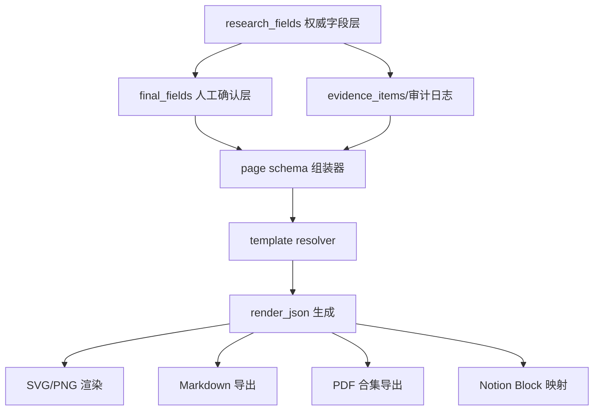

# GZHv2 研究模块与定稿模块改造技术文档

## 执行摘要

GZHv2 当前已经具备“研究采集 → 证据池 → 字段解析 → 定稿保存 → 导出”的主链路，但现状仍有三个结构性约束：其一，套卡层面目前内置的是 `v1` 八张与 `v2` 七张，`v2` 的默认卡片编排与本次目标不一致；其二，研究侧虽然已经有面向市场规模、用户指标、留存、单位经济的搜索意图模板、并行采集、证据池去重与字段状态标记，但字段体系仍偏向旧版卡片；其三，定稿 Markdown 构建器仍明显按旧版 `card_index` 分支组织，甚至对“壁垒/生态位”做了临时字符串拆分，说明最终排版层尚未真正做到“字段驱动的多套卡渲染”。这些判断都能从仓库的 `default_card_configs`、`search_plan.py`、`pipeline.py`、`evidence_pool.py`、`field_repo.py`、`markdown_builder.py` 与相关测试中直接看到。citeturn14view0turn12view0turn22view0turn22view1turn22view3turn23view4turn23view1turn28view1turn17view0turn17view2turn20view7

因此，本次改造的最稳妥路线不是“重写”，而是“在现有研究/定稿骨架上做增量扩展”：研究侧保留当前 `company_identity → search_plan → 多源并行采集 → evidence_pool → research_fields/final_fields` 的主架构，只增加新字段与新意图，不删除旧字段；定稿侧新增 `v3` 即“套卡3”，让 `card_set_registry`、`default_card_configs`、`final_fields/final_content` 同时支持八页新结构，并将渲染逻辑从硬编码 `card_index` 分支改为“模板 + 字段 DSL”驱动。这样做能最大化复用现有的 SQLite 表、并行采集、定稿保存与导出接口，同时避免破坏 `v1/v2` 既有数据与测试。citeturn14view0turn25view5turn25view1turn30view0turn30view1

最终建议如下：以 **`research_fields` 作为权威字段层**，以 **宽表 `research` 继续兼容旧读路径**，新增 `v3` 套卡并保留 `v1/v2`；研究模块新增“赛道、技术栈、运营指标、YouTube、客户证据、竞争位置”六类专用采集器；搜索层改为“模板扩展 + 无 LLM 并行抓取 + 证据优先级排序 + 缺口补采”模式；定稿层新增 PDF、Markdown、Notion 三路导出，并使用统一页面 DSL 做自动排版。预算、人力、部署环境、生产并发 KPI、目标认证方式均按用户要求标注为“未指定”；仓库当前实现虽实际使用 SQLite，但若未来生产目标库另有规划，该目标库类型本次记为“未指定”。citeturn24view0turn28view1turn29view0

## 基线判断与改造原则

先看仓库基线。当前编排库中，`card_set_registry` 内置了 `v1` 八张与 `v2` 七张；`v2` 的默认卡片分别是“封面、公司概览、产品与定位、创始人与团队、核心客户、GTM与增长、竞争格局”，对应字段也已经绑定到 `default_card_configs.config_json` 中。研究主流程里，`pipeline._collect_all()` 会先用 `company_identity` 生成别名与域名标识，再用 `search_plan.build_search_plan()` 生成查询，随后并行跑 Tavily、GitHub、YouTube 与官网四路采集，线程池上限当前为 `max_workers=4`。采集结果会进入证据池，证据池对 URL 做规范化、去 `utm_*` 等追踪参数、计算 `source_score` 与 `entity_score`，并按归一化 URL 去重。采集后还会持久化证据、运行 gap audit，并对 `research_fields` 执行字段分辨率标记与 `resolution_logs` 记录。citeturn14view0turn22view0turn22view1turn22view2turn22view3turn23view4turn23view2turn23view1turn28view2

但同时也能看到两个必须修的结构问题。第一，`search_plan.py` 已经具备 `market_size`、`revenue_metrics`、`user_metrics`、`retention_metrics`、`unit_economics`、`capital_efficiency`、`tech_stack` 等意图，这说明研究层已经部分走向“经营指标化”，但字段落地仍没有完全贴合你现在要的八页结构。第二，`markdown_builder.py` 仍保留旧式 `CARD_TITLES` 和 `card_index == 1..8` 手写分支，甚至通过字符串查找把 `moat` 人工切成“壁垒/生态位”，这在 `v3` 会迅速失控，因此必须改成字段驱动而不是继续加 if/else。相关测试也说明：当前最终导出已支持 `card_set_key` 与 `v2` 的整卡 Markdown 保存/JSON 导出，说明底层存储已经具备多套卡能力，短板主要在模板与字段编排层。citeturn12view0turn19view0turn17view0turn17view2turn20view6turn20view7

基于上述现状，改造应遵守五条原则：

| 原则 | 结论 | 实施含义 |
|---|---|---|
| 只增不减 | 不删除任何内置字段 | 老字段继续保留；新字段优先进入 `research_fields`，同步增补 `research` 宽表 |
| 字段权威单一 | `research_fields` 为权威字段源 | 宽表只做兼容与快速查读，不再作为唯一 schema 演进载体 |
| 搜索不依赖 LLM | 查询扩展、抓取、解析、去重全部可在无 LLM 模式下运行 | LLM 仅保留为“归纳/润色/兜底”，不参与高并发检索 |
| 官方源优先 | 官网、官方文档、官方博客、官方 API 第一优先级 | 第三方聚合源只作补充、交叉验证或缺口填补 |
| 渲染解耦 | 卡片页面由 DSL/模板驱动，而非 `card_index` 分支硬编码 | `v3` 可独立演进，不拖累 `v1/v2` |

这五条原则与仓库现有能力是兼容的：当前代码已经有多套卡注册、字段仓库、研究任务状态、证据池与最终导出，因此不需要推倒重来。citeturn13view0turn25view5turn28view1turn22view0turn23view4

## 字段与数据库设计

下表中的“映射到现有内置字段”仅指 **当前仓库已存在的字段名**；若仓库未提供一一对应字段，则明确写“未指定”。现有字段基线主要来自 `research` 宽表、`v2 default_card_configs`、`field_repo` 与旧 Markdown 构造逻辑。citeturn41view5turn14view0turn28view1turn17view2

**第一页：封面**

| 页面项 | 子字段/说明 | 新字段名 | SQLite 类型 | 必填 | 索引 | 映射到现有内置字段 | 示例值 |
|---|---|---|---|---|---|---|---|
| 公司名称 | 展示名 | `company_name` | TEXT | 是 | 主键侧已有 | `company_name` | `Perplexity` |
| 公司分类 | 一级分类 | `company_type` | TEXT | 是 | 普通索引 | `company_type` | `AI 搜索 / 消费级应用` |

**第二页：公司简介**

| 页面项 | 子字段/说明 | 新字段名 | SQLite 类型 | 必填 | 索引 | 映射到现有内置字段 | 示例值 |
|---|---|---|---|---|---|---|---|
| 赛道市场格局 | 一句话总结 | `market_landscape_summary` | TEXT | 是 | 普通索引 | 未指定 | `头部由三类玩家构成：原生 AI 搜索、传统搜索增强、垂直答案引擎。` |
| 赛道市场格局 | Top 玩家列表 | `market_landscape_top_players` | TEXT JSON | 否 | 否 | `competitors_summary` 部分映射 | `[{"name":"Google AI Overview"},{"name":"Perplexity"},{"name":"You.com"}]` |
| 赛道市场规模 | 数值 | `market_size_value` | REAL | 否 | 普通索引 | 未指定 | `12.5` |
| 赛道市场规模 | 币种 | `market_size_currency` | TEXT | 否 | 否 | 未指定 | `USD` |
| 赛道市场规模 | 口径年份 | `market_size_year` | INTEGER | 否 | 普通索引 | 未指定 | `2026` |
| 赛道年复合增长率 | 百分比 | `market_cagr` | REAL | 否 | 普通索引 | `market_cagr` | `24.3` |
| 赛道总潜在市场 | 数值 | `tam_value` | REAL | 否 | 普通索引 | `tam` 部分映射 | `48.0` |
| 赛道总潜在市场 | 币种 | `tam_currency` | TEXT | 否 | 否 | 未指定 | `USD` |
| 赛道总潜在市场 | 口径年份 | `tam_year` | INTEGER | 否 | 普通索引 | 未指定 | `2030` |
| 公司地理位置 | 总部/主要办公地 | `location` | TEXT | 是 | 普通索引 | `location` | `San Francisco, California, USA` |
| 公司成立时间 | 年/月/日 | `founded_date` | TEXT | 否 | 普通索引 | 未指定 | `2022-08-01` |
| 公司主营业务 | 业务概述 | `core_business` | TEXT | 是 | 否 | `company_def` 部分映射 | `面向知识工作者提供答案型搜索与研究助手。` |
| 公司核心竞争优势 | 公司级优势总结 | `core_competency` | TEXT | 否 | 否 | `moat` 部分映射 | `回答速度、引用体验与产品心智领先。` |
| 公司融资情况 | 摘要 | `funding_info` | TEXT | 否 | 否 | `funding_info` | `累计融资约 9 亿美元，投资方包括…` |
| 公司融资情况 | 结构化轮次 | `funding_rounds` | TEXT JSON | 否 | 否 | 未指定 | `[{"round":"Series C","date":"2025-12","amount":"500M USD"}]` |
| 公司取得成就 | 里程碑 | `company_achievements` | TEXT | 否 | 否 | 未指定 | `月查询量突破…；移动端下载量…` |
| 公司行业定位 | 定位语 | `industry_positioning` | TEXT | 否 | 普通索引 | `ecosystem_positioning` 部分映射 | `AI 原生答案引擎` |

**第三页：主产品**

| 页面项 | 子字段/说明 | 新字段名 | SQLite 类型 | 必填 | 索引 | 映射到现有内置字段 | 示例值 |
|---|---|---|---|---|---|---|---|
| 名称 | 主产品名 | `main_product_name` | TEXT | 是 | 普通索引 | `main_product_name` | `Perplexity Search` |
| 针对的痛点 | Pain points 列表 | `product_pain_points` | TEXT JSON | 否 | 否 | 未指定 | `["传统搜索结果冗长","信息源验证成本高"]` |
| 核心功能 | 功能清单 | `product_core_features` | TEXT JSON | 否 | 否 | 未指定 | `["答案生成","来源引用","追问","文件解析"]` |
| 核心用法玩法 | 典型工作流 | `product_usage_playbook` | TEXT | 否 | 否 | 未指定 | `先问结论，再要求引用，再让其归纳成提纲。` |
| 技术栈 | 产品技术栈摘要 | `product_tech_stack` | TEXT | 否 | 普通索引 | 未指定 | `Next.js + Python serving + 多模型路由 + 向量检索` |
| 地区市场 | 主市场区域 | `regional_market_focus` | TEXT JSON | 否 | 普通索引 | `regional` 类意图，无同名字段 | `["US","EU","JP"]` |
| 月活跃用户 | 数值 | `mau` | INTEGER | 否 | 普通索引 | 未指定 | `15000000` |
| 月活跃用户 | 统计周期 | `mau_as_of` | TEXT | 否 | 普通索引 | 未指定 | `2026-05` |
| 留存率 | 口径说明 | `retention_definition` | TEXT | 否 | 否 | 未指定 | `30日注册 cohort 留存` |
| 留存率 | 百分比 | `retention_rate` | REAL | 否 | 普通索引 | `retention_rate` | `38.5` |
| 定价明细 | 价格摘要 | `pricing_summary` | TEXT | 否 | 否 | 未指定 | `免费版+Pro 月付+Enterprise 定制` |
| 定价明细 | 梯度明细 | `pricing_tiers` | TEXT JSON | 否 | 否 | 未指定 | `[{"plan":"Pro","price":"20 USD/mo"}]` |

**第四页：创始团队**

| 页面项 | 子字段/说明 | 新字段名 | SQLite 类型 | 必填 | 索引 | 映射到现有内置字段 | 示例值 |
|---|---|---|---|---|---|---|---|
| 创始人姓名 | 主创始人 | `founder_name` | TEXT | 是 | 普通索引 | `founder_name` | `Aravind Srinivas` |
| 学历背景 | 教育经历 | `founder_edu` | TEXT | 否 | 否 | `founder_edu` | `PhD, UC Berkeley` |
| 工作背景 | 从业经历 | `founder_bg` | TEXT | 否 | 否 | `founder_bg` | `OpenAI / DeepMind 研究背景` |
| 过往成就 | 亮点 | `founder_achievement` | TEXT | 否 | 否 | `founder_achievement` | `在 NLP/IR 方向有代表性成果` |
| 团队规模 | 人数区间 | `team_size` | TEXT | 否 | 否 | `team_size` | `100-300` |
| 团队亮点 | 关键成员与能力 | `team_highlight` | TEXT | 否 | 否 | `team_highlight` | `研究、产品与增长同时较强` |

**第五页：用户群体**

| 页面项 | 子字段/说明 | 新字段名 | SQLite 类型 | 必填 | 索引 | 映射到现有内置字段 | 示例值 |
|---|---|---|---|---|---|---|---|
| 用户画像 | ICP/Persona | `ideal_customer_profile` | TEXT | 是 | 普通索引 | `ideal_customer_profile` | `高频知识工作者、研究员、咨询顾问、学生` |
| 用户画像 | 一级细分 | `customer_segment_primary` | TEXT | 否 | 普通索引 | `customer_segment_primary` | `知识工作者` |
| 用户画像 | 二级细分 | `customer_segment_secondary` | TEXT | 否 | 普通索引 | `customer_segment_secondary` | `学生/开发者` |
| 具体客户名称 | 客户列表 | `customer_names` | TEXT JSON | 否 | 否 | 未指定 | `["某咨询公司","某媒体编辑团队"]` |
| 客户选择理由 | 证据化表述 | `customer_selection_reasons` | TEXT | 否 | 否 | 未指定 | `因引用能力、检索速度和多轮追问显著优于传统搜索。` |
| 客户选择理由 | 证据明细 | `customer_choice_evidence` | TEXT JSON | 否 | 否 | 未指定 | `[{"type":"case_study","url":"..."},{"type":"review","quote":"..."}]` |

**第六页：公司能力分析**

| 页面项 | 子字段/说明 | 新字段名 | SQLite 类型 | 必填 | 索引 | 映射到现有内置字段 | 示例值 |
|---|---|---|---|---|---|---|---|
| 生态位分析 | 公司在生态链中的位置 | `ecosystem_niche` | TEXT | 是 | 否 | `ecosystem_niche` | `位于搜索入口与 AI 助手之间` |
| 变现能力 | 盈利策略 | `revenue_model` | TEXT | 否 | 否 | `revenue_model` | `订阅 + 企业版 + API/分发合作` |
| 变现能力 | 定价策略 | `pricing_strategy` | TEXT | 否 | 否 | 未指定 | `低门槛免费引流，Pro 订阅承接重度用户` |
| LTV | 数值 | `ltv` | REAL | 否 | 普通索引 | `ltv` | `240.0` |
| CAC | 数值 | `cac` | REAL | 否 | 普通索引 | `cac` | `80.0` |
| LTV/CAC | 比值 | `ltv_cac_ratio` | REAL | 否 | 普通索引 | `ltv_cac_ratio` | `3.0` |
| LTV/CAC | 是否行业均值 | `ltv_cac_is_benchmark` | INTEGER | 否 | 普通索引 | 未指定 | `1` |
| LTV/CAC | benchmark 来源 | `ltv_cac_benchmark_source` | TEXT | 否 | 否 | 未指定 | `Seed-stage B2B SaaS benchmark` |

**第七页：增长与 GTM**

| 页面项 | 子字段/说明 | 新字段名 | SQLite 类型 | 必填 | 索引 | 映射到现有内置字段 | 示例值 |
|---|---|---|---|---|---|---|---|
| 增长策略 | 核心增长逻辑 | `growth_strategy` | TEXT | 是 | 否 | `growth_strategy` | `内容传播 + 产品口碑 + 搜索替代心智` |
| GTM 动作 | 销售/分发动作 | `gtm_motion` | TEXT | 是 | 否 | `gtm_motion` | `PLG 为主，企业销售补充` |
| 冷启动 | 初期起量方式 | `cold_start` | TEXT | 否 | 否 | `cold_start` | `通过早期技术社群和产品演示积累口碑` |
| 增长飞轮 | 飞轮描述 | `growth_flywheel` | TEXT | 否 | 否 | `growth_flywheel` | `更好答案→更多分享→更多新用户→更多反馈` |
| 获客渠道 | 渠道列表 | `acquisition_channels` | TEXT JSON | 否 | 否 | 未指定 | `["SEO","社媒传播","口碑推荐","移动端应用商店"]` |

**第八页：竞争态势**

| 页面项 | 子字段/说明 | 新字段名 | SQLite 类型 | 必填 | 索引 | 映射到现有内置字段 | 示例值 |
|---|---|---|---|---|---|---|---|
| Top3 公司简介 | Top3 结构化 | `competitors_top3` | TEXT JSON | 是 | 否 | `competitors` / `competitors_summary` 部分映射 | `[{"name":"Google AI Overview","summary":"..."},{"name":"You.com","summary":"..."}]` |
| 被研公司在竞争中的位置 | 定位 | `competitive_position` | TEXT | 是 | 否 | `ecosystem_positioning` 部分映射 | `引用体验最强的答案型搜索` |
| 错位竞争机会 | 细分突破口 | `differentiated_opportunity` | TEXT | 否 | 否 | `differentiation_strategy` | `从“高可信引用”切入而非全栈模型比拼` |
| 竞争优势 | 竞争优势摘要 | `competitive_advantages` | TEXT | 否 | 否 | `moat` / `technical_barrier` / `switching_cost` 部分映射 | `速度、可信引用、产品心智、跨场景追问` |

**建议的数据库层改造**

上面对页面字段的定义，建议落到四层存储：

| 表 | 角色 | 本次动作 | 关键新增列 |
|---|---|---|---|
| `research` | 宽表兼容层 | 仅增列，不删列 | 上述所有新增字段对应宽列 |
| `research_fields` | 权威字段层 | 扩列 | `value_type`,`norm_value`,`currency_code`,`unit`,`as_of_date`,`evidence_ids`,`source_urls`,`page_no`,`sort_order` |
| `evidence_items` | 证据池 | 扩列 | `domain`,`published_at`,`lang`,`content_hash`,`robots_status`,`source_family` |
| `final_fields` | 定稿字段层 | 扩列 | `card_set_key`,`page_no`,`block_key`,`block_type`,`render_json`,`export_targets` |
| `default_card_configs` | 套卡模板注册 | 插入 `v3` | 无需改表，只需加配置 |
| `card_set_registry` | 套卡注册表 | 插入 `v3` | 无需改表，只需加记录 |

当前仓库已经明确存在 `research`、`research_jobs`、`research_fields`/`final_fields` 访问层、`card_set_registry`、`default_card_configs`、`final_content` 与 `card_set_key` 多套卡机制，因此这次 schema 变更以“增列 + 插入 v3 配置 + 扩展字段仓库”为主，不需要替换底层范式。citeturn41view0turn28view1turn29view0turn13view0turn25view5

下面给出可直接落地的 SQLite 迁移示例：

```sql
BEGIN TRANSACTION;

-- 套卡3注册
INSERT OR IGNORE INTO card_set_registry
(set_key, display_name, spec_version, card_count, is_system)
VALUES ('v3', '套卡3 · 研究增强版', 'v3', 8, 1);

-- research 宽表：只增不减
ALTER TABLE research ADD COLUMN market_landscape_summary TEXT;
ALTER TABLE research ADD COLUMN market_landscape_top_players TEXT;
ALTER TABLE research ADD COLUMN market_size_value REAL;
ALTER TABLE research ADD COLUMN market_size_currency TEXT;
ALTER TABLE research ADD COLUMN market_size_year INTEGER;
ALTER TABLE research ADD COLUMN tam_value REAL;
ALTER TABLE research ADD COLUMN tam_currency TEXT;
ALTER TABLE research ADD COLUMN tam_year INTEGER;
ALTER TABLE research ADD COLUMN founded_date TEXT;
ALTER TABLE research ADD COLUMN core_business TEXT;
ALTER TABLE research ADD COLUMN core_competency TEXT;
ALTER TABLE research ADD COLUMN funding_rounds TEXT;
ALTER TABLE research ADD COLUMN company_achievements TEXT;
ALTER TABLE research ADD COLUMN industry_positioning TEXT;
ALTER TABLE research ADD COLUMN product_pain_points TEXT;
ALTER TABLE research ADD COLUMN product_core_features TEXT;
ALTER TABLE research ADD COLUMN product_usage_playbook TEXT;
ALTER TABLE research ADD COLUMN product_tech_stack TEXT;
ALTER TABLE research ADD COLUMN regional_market_focus TEXT;
ALTER TABLE research ADD COLUMN mau INTEGER;
ALTER TABLE research ADD COLUMN mau_as_of TEXT;
ALTER TABLE research ADD COLUMN retention_definition TEXT;
ALTER TABLE research ADD COLUMN pricing_summary TEXT;
ALTER TABLE research ADD COLUMN pricing_tiers TEXT;
ALTER TABLE research ADD COLUMN customer_names TEXT;
ALTER TABLE research ADD COLUMN customer_selection_reasons TEXT;
ALTER TABLE research ADD COLUMN customer_choice_evidence TEXT;
ALTER TABLE research ADD COLUMN pricing_strategy TEXT;
ALTER TABLE research ADD COLUMN ltv_cac_is_benchmark INTEGER DEFAULT 0;
ALTER TABLE research ADD COLUMN ltv_cac_benchmark_source TEXT;
ALTER TABLE research ADD COLUMN acquisition_channels TEXT;
ALTER TABLE research ADD COLUMN competitors_top3 TEXT;
ALTER TABLE research ADD COLUMN competitive_position TEXT;
ALTER TABLE research ADD COLUMN differentiated_opportunity TEXT;
ALTER TABLE research ADD COLUMN competitive_advantages TEXT;

-- research_fields 扩列：字段型权威层
ALTER TABLE research_fields ADD COLUMN value_type TEXT;
ALTER TABLE research_fields ADD COLUMN norm_value TEXT;
ALTER TABLE research_fields ADD COLUMN currency_code TEXT;
ALTER TABLE research_fields ADD COLUMN unit TEXT;
ALTER TABLE research_fields ADD COLUMN as_of_date TEXT;
ALTER TABLE research_fields ADD COLUMN evidence_ids TEXT;
ALTER TABLE research_fields ADD COLUMN source_urls TEXT;
ALTER TABLE research_fields ADD COLUMN page_no INTEGER;
ALTER TABLE research_fields ADD COLUMN sort_order INTEGER DEFAULT 0;

CREATE INDEX IF NOT EXISTS idx_research_fields_company_page
ON research_fields(company_name, version, page_no, sort_order);

COMMIT;
```

## 研究模块设计

当前研究流程已经具备四个很有价值的基础：一是别名生成器会从输入名、展示名、域名根、host 以及带引号的“名称 + host”组合生成 aliases；二是 `search_plan.py` 已经把查询意图扩展到了 `market_size`、`user_metrics`、`retention_metrics`、`unit_economics`、`tech_stack` 等；三是主采集器是四路并行；四是证据池已经具备 URL 规范化、来源权重、实体匹配与去重能力。换句话说，研究模块并不缺骨架，缺的是 **字段-意图映射细度、非 LLM 采集器深度、源优先级策略与 YouTube/运营数据补强**。citeturn16view6turn12view0turn22view0turn22view1turn23view4turn23view2turn23view1

建议把研究模块拆成七个 Python 子模块：

| 模块 | 职责 | 关键输入 | 关键输出 |
|---|---|---|---|
| `identity_resolver.py` | 公司名消歧、域名归一 | 公司名、官网 URL | aliases、root_domain、canonical_company |
| `query_templates.py` | 按字段生成中英关键词模板 | aliases、field groups | query list |
| `search_backends.py` | 搜索 API 适配层 | query list | SERP/结果 URL |
| `source_fetchers.py` | 官网/API/社区/视频抓取 | URL 或 API 参数 | raw documents |
| `extractors.py` | 规则提取与结构化解析 | raw documents | typed field candidates |
| `normalizers.py` | 货币/日期/实体/数值标准化 | field candidates | normalized candidates |
| `field_writer.py` | 写入 `research_fields`/`research`/审计日志 | normalized candidates | DB rows + audit rows |

**字段到搜索意图的模板建议如下。** 这部分不依赖 LLM，直接靠 alias 展开与模板拼接。

| 字段组 | 中文模板 | 英文模板 | 备注 |
|---|---|---|---|
| TAM/市场规模 | `"{公司名} TAM"`、`"{公司名} 赛道市场规模"`、`"{公司名} 行业 CAGR"` | `"{company} TAM"`、`"{company} market size CAGR"` | 用于 `market_size_*`,`tam_*`,`market_cagr` |
| 技术栈 | `"{公司名} 技术栈"`、`site:{域名} engineering blog architecture` | `"{company} tech stack"`、`site:{host} architecture` | 用于 `product_tech_stack` |
| 主产品 | `"{公司名} 主产品 功能"`、`"{公司名} pricing"` | `"{company} product features"`、`site:{host} pricing` | 用于 `product_core_features`,`pricing_tiers` |
| 用户与运营 | `"{公司名} MAU"`、`"{公司名} retention"`、`"{公司名} active users"` | 同左 | 用于 `mau`,`retention_rate` |
| 客户 | `"{公司名} customers case study"`、`"{公司名} 客户案例"` | 同左 | 用于 `customer_names`,`customer_selection_reasons` |
| 融资与里程碑 | `"{公司名} funding round investors"`、`"{公司名} milestone"` | 同左 | 用于 `funding_rounds`,`company_achievements` |
| 竞争 | `"{公司名} competitors alternatives"`、`"{公司名} vs"` | 同左 | 用于 `competitors_top3`,`competitive_position` |
| YouTube | `"{公司名} founder interview"`、`"{公司名} demo"` | 同左 | 用于视频转写与情报补充 |

这其实是对当前 `search_plan.py` 的延伸而非推翻。当前仓库已经有 `overview/founders/funding/product/pricing/competitors/revenue/growth_metrics/regional/market_size/revenue_metrics/user_metrics/retention_metrics/unit_economics/capital_efficiency/achievement/tech_stack`，测试也直接验证了这些经营指标类意图已经存在。建议新增的是：`customers`,`pricing_details`,`youtube_transcript`,`competitive_position`,`differentiated_opportunity` 五组模板。citeturn12view0turn19view0turn20view4

### 数据源与工具优先级

**原则：官方源 > 原始数据/API > 高质量聚合源 > 社区源。**

| 信息类型 | 一级来源 | 二级来源 | 三级来源 | 选择理由 |
|---|---|---|---|---|
| 公司定义/产品/价格 | 官网、官方博客、官方文档、官方定价页 | GitHub 官方仓库、YouTube 官方频道 | Product Hunt / Reddit / HN | 业务口径最权威，且可直接绑定官网域名 |
| 融资/成立/地理位置 | 官网 About/Press、官方新闻稿 | Crunchbase/PitchBook/TechCrunch | 社区访谈 | 需优先使用可回溯原文 |
| 技术栈 | 官网前端指纹、响应头、JS bundle、公有 repo | BuiltWith Domain API、Wappalyzer Lookup | 自研规则补充 | 技术栈本质是公开前端信号推断，官方站本身最直接 |
| 流量/地域/渠道 | 公司官方披露 | Similarweb Traffic & Engagement / Geography、Semrush Trends Traffic Summary / Geo | 自建替代表征 | 第三方流量估算本来就是模型输出，需标注“估算” |
| YouTube | 官方 YouTube Data API 搜索/元数据 | 自有字幕/授权字幕下载 | `yt-dlp` 提取字幕、Whisper ASR | 官方 API 能做搜索和元数据，但对任意公开视频字幕并不总可直接拿到文本 |
| 客户证据 | Case Study / 官方客户页 | App Store / Chrome Web Store / G2 / Reddit | 社区帖子 | 客户名字与“选择理由”必须尽量配原文出处 |

关于工具选型，官方文档显示：BuiltWith API 提供 Domain API、Change API、Lists API 等，可返回当前与历史技术信息；Wappalyzer 提供 technographic 目录与 lookup，基于 HTML、脚本、头、cookies 等公开信号识别站点技术；Similarweb 网站分析 API可以返回 visits、bounce_rate、pages_per_visit、unique_visitors 以及国家维度的 traffic geography；Semrush API 则同时覆盖 SEO、backlinks 与 Trends/Traffic/Geo 等市场流量信息。citeturn33view0turn32search0turn32search6turn31search0turn31search2turn34view2

据此，建议的“付费/免费”梯度如下：

| 场景 | 首选 | 付费/免费 | 替代方案 | 备注 |
|---|---|---|---|---|
| 技术栈识别 | BuiltWith Domain API | 付费为主，含免费低配接口 | Wappalyzer Lookup、自研前端指纹 | BuiltWith 历史变化能力更强；Wappalyzer 免费可做单域 lookup |
| 网站流量/国家分布 | Similarweb API | 付费 | Semrush Trends/Traffic、公司自披露 | Similarweb 指标更像“访问行为层”；需明确为估算值 |
| SEO/竞品搜索流量 | Semrush API | 付费 | 官网 sitemap/索引页/品牌搜索趋势、自建 SERP 抽样 | Semrush 更适合 SEO 与搜索竞争层面 |
| 批量聚合与分析中台 | OpenBB | 开源 | 自建 pandas/duckdb | 适合作为多数据源统一访问层 |
| 大规模网页抽取 | Crawl4AI | 开源 | 现有 requests/httpx + Playwright | 适合作为非 LLM 抽取增强层 |

其中，OpenBB 官方把自身定位为开源数据集成框架，强调“数据工程接一次、分析多端消费”；Crawl4AI 官方文档则明确强调“开源、面向 LLM/搜索/数据管道的高性能抓取与抽取”。这两类项目不直接替代 BuiltWith/Similarweb，但很适合借鉴其“多源标准化接入、统一消费层、可本地部署”的架构思想。citeturn40search0turn40search3

### YouTube 内容提取策略

YouTube 侧建议采用“三层回退”：

| 层级 | 方法 | 适用条件 | 输出 |
|---|---|---|---|
| 第一层 | YouTube Data API `search.list` 搜视频元数据 | 全量可用 | `video_id`,`title`,`publishedAt`,`channel`,`description` |
| 第二层 | 官方 captions 流程 | 仅对有授权范围的视频可直接用 | 字幕轨与带时间戳字幕 |
| 第三层 | `yt-dlp` 提取公开字幕 / 自动字幕 | 授权字幕不可用时 | `.vtt/.srt` |
| 第四层 | Whisper ASR | 无字幕时 | 转写文本与分段时间戳 |
| 第五层 | PySceneDetect + FFmpeg 关键帧 | 需要视觉辅助摘要时 | scene list、关键帧图、时间戳片段 |

Google 官方文档显示：YouTube Data API 的 `search.list` 可检索视频、频道与播放列表，单次查询有明确 quota；`captions.list` 只返回字幕轨元信息，不返回字幕正文；字幕正文需 `captions.download`，且需要 OAuth 授权范围。这意味着，对于任意第三方公开视频，不能把官方 captions 当成一条稳定的普适路径，因此工程上必须准备字幕抓取或本地 ASR 兜底。Whisper 官方说明其是基于 68 万小时多语种监督数据训练的 ASR 系统；PySceneDetect 官方文档说明可做场景切分，且依赖 ffmpeg 进行视频切片支持；`yt-dlp` 项目则长期作为视频/音频抓取工具存在。citeturn37search1turn38search0turn38search2turn38search9turn38search1turn36search1turn35search5turn36search12

建议的视频抽取伪代码如下：

```python
def extract_youtube_intel(video_url: str) -> dict:
    meta = youtube_api.search_or_lookup(video_url)   # 标题/频道/发布日期
    subs = try_official_or_public_subtitles(video_url)  # vtt/srt/txt
    if not subs:
        audio_path = ytdlp_download_audio(video_url)
        subs = whisper_transcribe(audio_path, language="auto")
    scenes = scenedetect_extract(video_url, max_scenes=12)
    summary = summarize_timestamp_blocks(subs, scenes)
    return {
        "meta": meta,
        "transcript": subs,
        "scenes": scenes,
        "timestamp_summary": summary,
    }
```

### 无 LLM 并行抓取架构

当前仓库主流程只在顶层 source fan-out 上用了 `ThreadPoolExecutor(max_workers=4)`。这对 Tavily/GitHub/YouTube/website 四源足够，但对“几十组字段模板 × 多搜索后端 × 多详情页抓取”是不够的。建议把研究阶段拆成两层并发：

| 并发层 | 技术手段 | 建议 |
|---|---|---|
| 查询层 | `asyncio` + `httpx.AsyncClient` | 负责搜索 API、官网 API、静态页 GET |
| 页面层 | `asyncio.Semaphore(host)` + 有界 worker | 负责详情页抓取、解析、抽取 |
| JS 页面层 | Playwright worker pool | 仅对必须执行 JS 的站点启用 |
| 视频层 | 有界任务队列 | 避免大视频下载/ASR 压垮主抓取链路 |

示例脚本结构如下：

```python
import asyncio
import hashlib
import json
from collections import defaultdict
from urllib.parse import urlparse

import httpx
from bs4 import BeautifulSoup
from tenacity import retry, stop_after_attempt, wait_exponential

GLOBAL_CONCURRENCY = 8        # 运行默认值；性能目标未指定
PER_HOST_CONCURRENCY = 2
TIMEOUT = httpx.Timeout(20.0, connect=10.0)

class FetchContext:
    def __init__(self):
        self.host_limiters = defaultdict(lambda: asyncio.Semaphore(PER_HOST_CONCURRENCY))
        self.seen = set()

def norm_url(url: str) -> str:
    parsed = urlparse(url)
    return f"{parsed.scheme}://{parsed.netloc.lower()}{parsed.path.rstrip('/')}"

@retry(stop=stop_after_attempt(3), wait=wait_exponential(min=1, max=8))
async def fetch_text(client: httpx.AsyncClient, url: str, ctx: FetchContext) -> dict:
    host = urlparse(url).netloc.lower()
    async with ctx.host_limiters[host]:
        r = await client.get(url, follow_redirects=True)
        r.raise_for_status()
        text = r.text[:500_000]
        return {
            "url": url,
            "norm_url": norm_url(url),
            "status_code": r.status_code,
            "content_type": r.headers.get("content-type", ""),
            "html": text,
            "sha1": hashlib.sha1(text.encode("utf-8", "ignore")).hexdigest(),
        }

def extract_visible_text(html: str) -> str:
    soup = BeautifulSoup(html, "lxml")
    for tag in soup(["script", "style", "noscript"]):
        tag.decompose()
    return " ".join(soup.get_text(" ").split())

async def worker(urls: list[str]) -> list[dict]:
    ctx = FetchContext()
    async with httpx.AsyncClient(timeout=TIMEOUT, headers={"User-Agent": "GZHv2ResearchBot/1.0"}) as client:
        tasks = []
        for url in urls:
            n = norm_url(url)
            if n in ctx.seen:
                continue
            ctx.seen.add(n)
            tasks.append(fetch_text(client, url, ctx))
        docs = await asyncio.gather(*tasks, return_exceptions=True)

    result = []
    for doc in docs:
        if isinstance(doc, Exception):
            result.append({"status": "error", "error": repr(doc)})
            continue
        result.append({
            "status": "ok",
            "url": doc["url"],
            "norm_url": doc["norm_url"],
            "sha1": doc["sha1"],
            "text": extract_visible_text(doc["html"]),
        })
    return result
```

这个脚本要点有四个。第一，**去重** 用规范化 URL 与内容 hash 双重去重；第二，**限速** 不是全局 sleep，而是按 host 建立 `Semaphore`；第三，**错误处理** 用指数退避重试，可区分 403/429/5xx；第四，**不调用 LLM**，纯靠模板搜索、HTML 解析、规则抽取与证据排序先把广度做上去。其设计思想与仓库现有 evidence pool 的 URL 归一化、去重和基于来源/实体匹配打分是完全一致的，只是并发粒度更细了。citeturn23view4turn23view2turn23view1

### 数据清洗、实体解析与入库审计

建议把数据清洗定义成确定性的、可审计的规则链，而不是提示词链：

| 问题 | 规则 | 落库字段 |
|---|---|---|
| 公司名消歧 | 名称、host、root_domain、官网 title 联合判定；命中官网域名优先 | `canonical_company_name`,`aliases` |
| 时间标准化 | 所有日期转 ISO 8601；只有年份则存 `YYYY` | `as_of_date`,`published_at`,`founded_date` |
| 货币标准化 | 原值保留；数值转 `REAL`；币种单列 | `*_value`,`*_currency` |
| 比率标准化 | `38%` → `38.0`，统一百分比数值口径 | `market_cagr`,`retention_rate`,`ltv_cac_ratio` |
| BU/产品/客户实体 | 域名匹配 + 模糊相似度 + 官方名单优先 | `customer_names`,`competitors_top3` |
| 证据绑定 | 每个字段写 `evidence_ids` 与 `source_urls` JSON | `research_fields.evidence_ids`,`source_urls` |

当前仓库已经有 `research_fields` 的批量写入接口，以及 `update_field_status_batch()` 对 `research_fields` 状态列与 `resolution_logs` 的批量更新逻辑；同时 `final_fields` 已是“按字段而非按卡片”保存的定稿表。因此，入库建议直接延续这一思路：**抓取器写候选，标准化器写最终值，审计器写证据绑定与 resolution logs**。citeturn28view1turn28view2turn29view0

可直接实现的函数签名建议如下：

```python
def build_company_identity(company_name: str, website_url: str | None) -> dict: ...
def build_field_queries(identity: dict, field_keys: list[str]) -> list[dict]: ...
async def run_parallel_search(queries: list[dict], backends: list[str]) -> list[dict]: ...
async def fetch_documents(search_hits: list[dict]) -> list[dict]: ...
def extract_field_candidates(field_key: str, documents: list[dict]) -> list[dict]: ...
def normalize_candidate(field_key: str, candidate: dict) -> dict: ...
def select_best_candidate(field_key: str, candidates: list[dict]) -> dict: ...
def upsert_research_fields(db_path: str, company_name: str, rows: list[dict]) -> int: ...
def append_audit_logs(db_path: str, company_name: str, logs: list[dict]) -> int: ...
```

### 指标与计算方法

指标口径建议在系统内置为“可计算 + 可追溯 + 可标注来源”。

| 指标 | 推荐公式/口径 | 抓取或推导策略 |
|---|---|---|
| TAM | `目标客户数 × 每客户年均可得收入`，或 top-down 行业市场容量 | 优先行业报告/公司披露；缺失时明确 top-down 推导 |
| 赛道市场规模 | 当前年度行业总收入/GMV/支出 | 抓行业报告、协会、咨询公司原文，保留年份与币种 |
| CAGR | `((期末值 / 期初值)^(1/n) - 1) × 100%` | 直接算，不依赖原文给出的 CAGR |
| LTV | `ARPU × 毛利率 ÷ Churn`，或 `平均客单价 × 购买频次 × 生命周期` | 若公司数据缺失，读取行业 benchmark provider |
| CAC | `(销售+市场获客成本) ÷ 新增客户数` | 优先公司披露；缺失则行业 benchmark |
| LTV/CAC | `LTV ÷ CAC` | 若两项均缺失，写 benchmark 且标注 `is_benchmark=1` |
| MAU | 30 天内触发“有意义行为”的去重用户数 | 平台公开数据、公司披露、App/Extension/第三方估算交叉验证 |
| 留存率 | 默认 `N-day` 或 `30日 cohort retained / cohort size` | 若来源未说明口径，必须同时写 `retention_definition` |

MAU 的定义，Mixpanel 与 Amplitude 都强调“active”必须是有意义行为的唯一次数而非纯登录；Amplitude 对 retention 的常见定义则明确指出常用的是 `N-Day` 返回比例。YouTube/站点类产品若无法拿到公司自有分析后台，只能把 MAU 当作 **推断指标**，来源必须标明“估算/披露/推断”。CAGR 公式则用标准金融公式即可。citeturn44search0turn44search10turn44search6

对 LTV/CAC，需要额外加一条工程规则：**系统绝不能把 benchmark 写成公司事实。** 若无公司数据，则在页面上明确输出“行业平均/阶段平均，来源：xxx，非公司披露值”。如果项目需要先设默认值，建议把 benchmark 做成配置表，而不是写死在代码里；若临时需要行业占位，B2B SaaS 可用外部 benchmark provider 给的常见 3:1 左右区间作为占位，但必须连同 stage 与来源一起显示，不可裸用。citeturn43search1turn43search4

### 合规与反爬

合规上，最低要求是遵守 RFC 9309 定义的 robots exclusion 规则；IETF 标准文本明确说明 REP 是网站方向 crawler 发出的访问控制请求规则，并包含对访问结果、缓存与解析错误的说明。与此同时，robots 不是授权机制，因此“可以抓”不等于“可以商用再分发”；仍需遵守站点 ToS、版权、隐私与 API 许可。Scrapy 的 AutoThrottle 文档也说明自动调速的目标就是“对被抓站点更友好并按负载动态调节速度”。citeturn39search0turn39search3

因此，建议的合规与反爬策略如下：

| 维度 | 建议 |
|---|---|
| robots | 首次访问前检查 `robots.txt`；结果缓存 24h；被禁路径不抓 |
| 速率限制 | 默认按 host 限并发；对 429/503 自动指数退避 |
| IP 池 | 仅对合法公开页面、且业务确有规模需求时使用；登录态、个人数据、付费墙内容禁止 |
| Header/UA | 固定、可识别的研究型 UA；避免伪装真实用户 |
| Cookie/会话 | 非必要不保存；若站点要求同意 cookie，需显式流程记录 |
| 隐私 | 不抓用户个人敏感信息；客户名称只保留已公开案例 |
| 缓存 | 相同 URL 先读缓存再抓；减少重复访问 |
| 反爬识别 | 检测验证码、JS challenge、403/429 模式，写入 `robots_status`/`fetch_status`，不要死磕 |

## 定稿模块设计

当前代码已经证明：系统支持 `card_set_key`、按卡片保存 `markdown_full`、按套卡导出 JSON/Markdown，而且 `default_card_configs` 已经是“字段列表 + media 列表 + template_id”的 DSL 雏形。因此，套卡3不需要发明新范式，只要把 **`v3` 套卡的页面 DSL** 明确定义出来，并把渲染器从旧的 `card_index`-case 分支迁移到“page schema + template renderer”即可。citeturn14view0turn25view5turn25view1turn30view0

建议定义如下 `v3` 套卡：

```sql
INSERT OR REPLACE INTO default_card_configs
(set_key, card_id, card_index, card_title, config_json) VALUES
('v3','v3_card_01',1,'封面',
 '{"fields":["company_name","company_type"],"media":["logo"],"template_id":"cover_v3"}'),
('v3','v3_card_02',2,'公司简介',
 '{"fields":["market_landscape_summary","market_size_value","market_size_currency","market_size_year","market_cagr","tam_value","tam_currency","tam_year","location","founded_date","core_business","core_competency","funding_info","company_achievements","industry_positioning"],"media":["website_screenshot"],"template_id":"company_intro_v3"}'),
('v3','v3_card_03',3,'主产品',
 '{"fields":["main_product_name","product_pain_points","product_core_features","product_usage_playbook","product_tech_stack","regional_market_focus","mau","mau_as_of","retention_definition","retention_rate","pricing_summary","pricing_tiers"],"media":["product_main"],"template_id":"product_v3"}'),
('v3','v3_card_04',4,'创始团队',
 '{"fields":["founder_name","founder_edu","founder_bg","founder_achievement","team_size","team_highlight"],"media":["founder_photo"],"template_id":"founder_v3"}'),
('v3','v3_card_05',5,'用户群体',
 '{"fields":["ideal_customer_profile","customer_segment_primary","customer_segment_secondary","customer_names","customer_selection_reasons"],"media":["customer_logos"],"template_id":"users_v3"}'),
('v3','v3_card_06',6,'公司能力分析',
 '{"fields":["ecosystem_niche","revenue_model","pricing_strategy","ltv","cac","ltv_cac_ratio","ltv_cac_is_benchmark","ltv_cac_benchmark_source"],"media":["chart_ecosystem"],"template_id":"capability_v3"}'),
('v3','v3_card_07',7,'增长与GTM',
 '{"fields":["growth_strategy","gtm_motion","cold_start","growth_flywheel","acquisition_channels"],"media":["flywheel"],"template_id":"gtm_growth_v3"}'),
('v3','v3_card_08',8,'竞争态势',
 '{"fields":["competitors_top3","competitive_position","differentiated_opportunity","competitive_advantages"],"media":["chart_competitive"],"template_id":"competition_v3"}');
```

版式上，建议不要再把所有页都做成一个模板家族，而是做成三类模板就够：

| 模板家族 | 适用页 | 版式逻辑 |
|---|---|---|
| `cover_v3` | 第 1 页 | 大标题 + 分类 + Logo |
| `fact_grid_v3` | 第 2、4、5、6 页 | 左侧摘要，右侧事实块/徽标/小图表 |
| `product_story_v3` | 第 3、7、8 页 | 上半标题摘要，下半要点列表 + 图表/矩阵 |

视觉规范建议：

| 项 | 建议 |
|---|---|
| 基础尺寸 | 延续现有 800×800 内部画布；导出时 2x/3x 放大 |
| 字体 | 中文无衬线，标题 700/900，正文 400/500 |
| 字色 | 深灰正文，深色标题，强调色仅用于指标/竞争位置 |
| 层级 | 标题 > 栏目小标题 > 要点 > 证据注记 |
| 数字规则 | 所有金额、百分比、年份统一格式化 |
| 证据脚注 | 页底显示 `来源类型 + 年月`，不堆整 URL |
| JSON 字段渲染 | 列表渲染为 bullet、徽标条、标签组或表格卡片 |

当前 `infographic.py` 的公开 API 已支持按 `template_id` 渲染模板，默认 SVG 画布为 800×800，再转 PNG；这意味着实现 `v3` 的最小改造是“新增模板模块”，而不是重写导出器。citeturn16view7

自动化排版流程建议如下：



自动化排版可采用如下工具链：

| 目标 | 工具链 | 说明 |
|---|---|---|
| PNG/SVG | 现有 `infographic.py` + 新 `template_id` | 改动最小 |
| PDF | SVG/PNG 合成 + WeasyPrint/ReportLab | 适合 8 页整包导出 |
| Markdown | `final_fields` → mdast/模板 | 保留文本可编辑性 |
| Notion | render_json → Notion block tree | 用户认证方式未指定，因此先做 exporter 抽象，不固化 auth 实现 |

示例排版伪代码：

```python
def build_page_payload(company: str, page_no: int, card_set_key: str = "v3") -> dict:
    schema = card_config_repo.get_default_card_configs(DB_COMPOSITION, set_key=card_set_key)[page_no - 1]
    fields = load_final_or_research_fields(company, schema["config"]["fields"])
    payload = {
        "company_name": company,
        "page_no": page_no,
        "title": schema["card_title"],
        "template_id": schema["config"]["template_id"],
        "fields": fields,
        "evidence_footnotes": build_footnotes(fields),
    }
    return payload

def render_export_bundle(company: str, card_set_key: str = "v3") -> dict:
    pages = [build_page_payload(company, i, card_set_key) for i in range(1, 9)]
    pngs = [render_svg_page(p) for p in pages]
    pdf_path = export_pdf_from_pngs(company, pngs)
    md_path = export_markdown_bundle(company, pages)
    notion_payload = build_notion_blocks(pages)  # auth 未指定
    return {"pngs": pngs, "pdf": pdf_path, "markdown": md_path, "notion": notion_payload}
```

一个页面的可视化草图可以先用文本 DSL 表示，工程师更容易实现：

```text
[公司简介页 / company_intro_v3]

┌──────────────────────────────┐
│ 公司名 / 行业定位             │
│ 一句话主营业务                │
├──────────────┬───────────────┤
│ 市场格局      │ 市场规模 / CAGR │
│ TAM / 年份    │ 地理位置 / 成立  │
├──────────────┴───────────────┤
│ 融资情况 / 公司成就 / 核心优势 │
├──────────────────────────────┤
│ 页脚：来源类型 + 统计年月      │
└──────────────────────────────┘
```

## 测试部署迁移与工作分解

测试上，仓库本身已经有 `test_search_plan.py`、`test_pipeline.py`、`test_db_fields.py`、`test_markdown_builder.py`、`test_app.py` 等基础测试集，这说明项目不是“无测试”状态，而是“已有测试框架但尚未覆盖 v3 字段与模板”。因此，本次应在现有 pytest/unittest 体系内追加，而不是另起炉灶。citeturn18view0turn19view0turn19view1turn19view2turn19view3turn19view4

建议测试矩阵如下：

| 测试层 | 覆盖点 | 通过标准 |
|---|---|---|
| 单元测试 | query 模板展开、金额解析、日期标准化、公司名消歧、字段映射、模板渲染 | 输入输出 deterministic |
| 集成测试 | 一次完整“研究→字段落库→定稿→导出 v3” | 8 页全部可导出 |
| 回归测试 | `v1/v2` 旧接口、旧导出、旧 final save | 不破坏既有行为 |
| 数据质量测试 | 必填字段覆盖率、来源覆盖率、重复 URL 比、无效 JSON 比 | 低于阈值则 fail |
| 性能测试 | 查询 fan-out、页面抓取、YouTube 处理队列 | 吞吐量目标未指定 |
| 迁移测试 | migration 幂等、回滚恢复、历史数据兼容 | 连续执行多次无破坏 |

推荐的数据质量指标：

| 指标 | 建议阈值 |
|---|---|
| 必填字段覆盖率 | `>= 95%` |
| 非必填字段覆盖率 | `>= 70%` |
| 官方/原始来源占比 | `>= 60%` |
| 去重后有效证据数 | `>= 15` |
| JSON 字段可解析率 | `>= 99%` |
| 有审计日志的字段占比 | `>= 95%` |

CI/CD 建议采用 GitHub Actions 即可，流程分三段：`lint + unit`、`integration + migration smoke`、`render snapshot parity`。其中渲染快照测试尤其重要，因为 `v3` 最大风险不在接口，而在版面崩坏。性能基准中的目标并发数与吞吐量，按用户要求标注为“未指定”；工程默认运行参数可配，但不把它写成 KPI。citeturn20view7turn16view7

### 迁移与回滚策略

迁移必须采用“影子写入 + 双读兼容 + 延迟切换”：

| 阶段 | 动作 |
|---|---|
| 预迁移 | 备份 SQLite 文件；记录 schema 版本 |
| 迁移 | 先加列、加索引、插入 `v3` 套卡配置 |
| 回填 | 根据旧字段逻辑回填 `v3` 可复用字段，例如 `company_def → core_business`（仅当新字段为空） |
| 双读 | 渲染器优先读 `final_fields/research_fields`，回退到旧 `research` 字段 |
| 切换 | 前端默认展示 `v3`，但保留 `v1/v2` 手动切换 |
| 稳定期 | 观察审计日志与导出失败率 |
| 清理 | 不删旧字段，不删旧套卡 |

SQLite 回滚不宜依赖 `DROP COLUMN`，最稳妥的是 **整库备份文件回滚**。若必须做脚本化回滚，做法是：创建旧 schema 新表、把兼容字段 copy 回去、rename 替换。示例迁移脚本如下：

```python
import shutil
import sqlite3
from pathlib import Path

def migrate_research_db(db_path: str):
    backup = f"{db_path}.bak"
    shutil.copy2(db_path, backup)

    conn = sqlite3.connect(db_path)
    try:
        conn.executescript(Path("db/migrations/010_v3_fields.sql").read_text(encoding="utf-8"))
        conn.commit()
    except Exception:
        conn.rollback()
        conn.close()
        shutil.copy2(backup, db_path)
        raise
    finally:
        try:
            conn.close()
        except Exception:
            pass
```

### 工作分解与时间表

预算、人力均未指定，因此这里只给出标准工程 WBS 与相对估时。若按 1 名后端 + 1 名前端/模板工程师 + 1 名测试协作的轻量配置推进，节奏较稳；若人力不足，则应优先完成“字段层 + 搜索层 + v3 导出最小闭环”，把 Notion、复杂图表与高级视频摘要放到第二阶段。

| 里程碑 | 核心产出 | 预计工时 | 依赖 |
|---|---|---:|---|
| 基线梳理 | 字段清单、映射表、迁移设计 | 2–3 天 | 无 |
| Schema 增量改造 | SQL migration、repo 扩列、字段 manifest | 2–4 天 | 基线梳理 |
| 搜索与抓取增强 | query 模板、并发抓取器、YouTube 模块、tool adapters | 4–7 天 | Schema |
| 规则抽取与标准化 | market/price/metric/customer/competition 解析器 | 3–5 天 | 抓取增强 |
| v3 套卡模板 | `default_card_configs` + 新模板 + 导出器 | 4–6 天 | Schema |
| 测试与稳定化 | 单测、集成、迁移回滚、快照测试 | 3–5 天 | 前述全部 |
| 上线与观察 | 灰度切换、审计看板、错误修复 | 2–3 天 | 测试完成 |

如果要把以上内容凝练成一句真正可执行的工程结论，就是：**把 GZHv2 从“旧卡片字段驱动的研究系统”升级成“字段权威层 + 无 LLM 高并发检索层 + 可配置多套卡渲染层”的增量版本**。现有仓库已经提供了多套卡、字段仓库、证据池、顶层并行采集与导出能力；本次改造不应浪费这些基础，而应围绕它们做 schema 增量、采集深化和模板解耦。citeturn22view0turn22view1turn23view4turn28view1turn14view0turn25view1